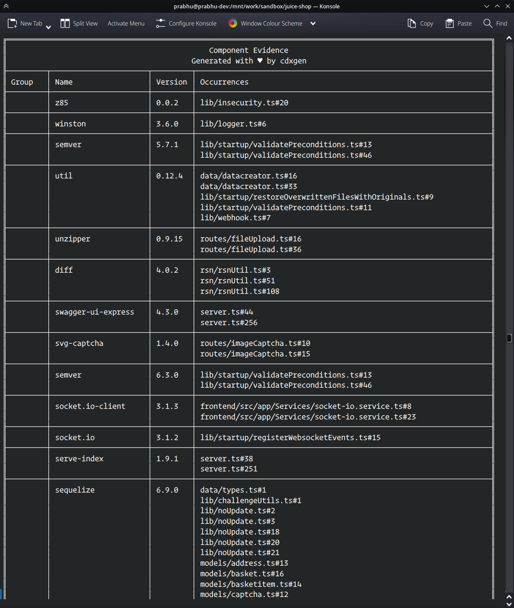
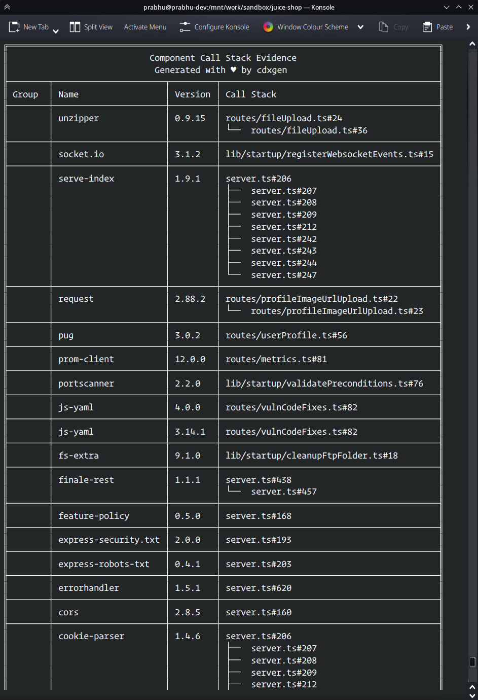
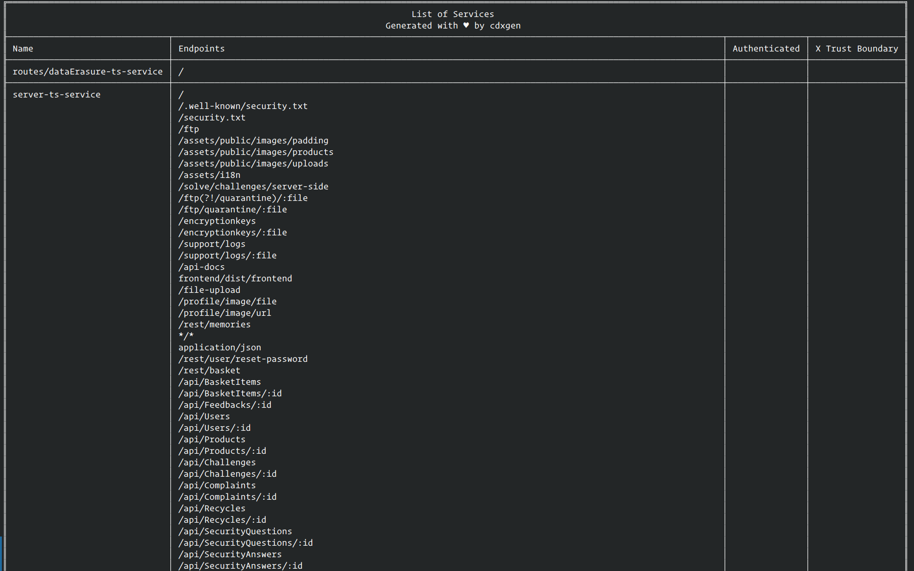

# Advanced Usage

## Evinse Mode / SaaSBOM

Evinse (Evinse Verification Is Nearly SBOM Evidence) is a new command with cdxgen to generate component evidence and SaaSBOM for supported languages. The tool is powered by [atom](https://github.com/AppThreat/atom)







### Pre-requisites

- Java >= 21 installed
- Application source code
- Input SBOM in CycloneDX >1.5 format. Use cdxgen to generate one.

### Usage

```shell
evinse -h
Options:
  -i, --input                    Input SBOM file. Default bom.json
                                                           [default: "bom.json"]
  -o, --output                   Output file. Default bom.evinse.json
                                                    [default: "bom.evinse.json"]
  -l, --language                 Application language
  [choices: "java", "jar", "javascript", "python", "android", "cpp"] [default: "
                                                                          java"]
      --db-path                  Atom slices DB path. Default /home/prabhu/.loca
                                 l/share/.atomdb
                                  [default: "/home/prabhu/.local/share/.atomdb"]
      --force                    Force creation of the database
                                                      [boolean] [default: false]
      --skip-maven-collector     Skip collecting jars from maven and gradle cach
                                 es. Can speedup re-runs if the data was cached
                                 previously.          [boolean] [default: false]
      --with-deep-jar-collector  Enable collection of all jars from maven cache
                                 directory. Useful to improve the recall for cal
                                 lstack evidence.     [boolean] [default: false]
      --annotate                 Include contents of atom slices as annotations
                                                       [boolean] [default: true]
      --with-data-flow           Enable inter-procedural data-flow slicing.
                                                      [boolean] [default: false]
      --usages-slices-file       Use an existing usages slices file.
                                                 [default: "usages.slices.json"]
      --data-flow-slices-file    Use an existing data-flow slices file.
                                              [default: "data-flow.slices.json"]
  -p, --print                    Print the evidences as table          [boolean]
      --version                  Show version number                   [boolean]
  -h                             Show help                             [boolean]
```

To generate an SBOM with evidence for a java project.

```shell
evinse -i bom.json -o bom.evinse.json <path to the application>
```

By default, only occurrence evidences are determined by creating usages slices. To generate callstack evidence, pass `--with-data-flow`

```shell
evinse -i bom.json -o bom.evinse.json --with-data-flow <path to the application>
```

To improve performance, you can cache the generated usages and data-flow slices file along with the bom file.

```shell
evinse -i bom.json -o bom.evinse.json --usages-slices-file usages.json --data-flow-slices-file data-flow.json --with-data-flow <path to the application>
```

For JavaScript or TypeScript projects, pass `-l javascript`.

```shell
evinse -i bom.json -o bom.evinse.json --usages-slices-file usages.json --data-flow-slices-file data-flow.json -l javascript --with-data-flow <path to the application>
```

## Generate SBOM from maven or gradle cache

There could be Java applications with complex dependency requirements. Or you might be interested in cataloging your Maven or gradle cache.
A bonus of this mode is that the resulting SBOM would have a property called `Namespaces` with a list of class names belonging to each jar.

### Generate evidence of usage

After generating an SBOM from a cache, we can now look for evidence of direct usage with evinse!

```shell
# compile or build your application
evinse -i <bom from cache> -o bom.evinse.json <application path>
# Generate data-flow evidence (Takes a while)
# evinse -i <bom from cache> -o bom.evinse.json --with-data-flow <application path>
```

Evinse would populate component.evidence object with occurrences (default) and callstack (in data-flow mode). Those without evidence are either transitive or unused dependencies.

To improve performance for re-runs, pass the argument `--skip-maven-collector` to use the data cached in the SQLite database from the previous runs.

## Interactive mode

`cdxi` is a new interactive REPL server to create, import, and search a BOM. All the exported functions from cdxgen and node.js could be used in this mode. In addition, several custom commands are defined.

[](https://asciinema.org/a/602361)

### Custom commands

| Command      | Description                                                                                                                                                                                                    |
| ------------ | -------------------------------------------------------------------------------------------------------------------------------------------------------------------------------------------------------------- |
| .create      | Create an BOM from a path                                                                                                                                                                                      |
| .import      | Import an existing BOM from a path. Any BOM in CycloneDX format is supported.                                                                                                                                  |
| .search      | Search the given string in the components name, group, purl and description                                                                                                                                    |
| .sort        | Sort the components based on the given attribute. Eg: .sort name to sort by name. Accepts full jsonata [order by](http://docs.jsonata.org/path-operators#order-by-) clause too. Eg: `.sort components^(>name)` |
| .query       | Pass a raw query in [jsonata](http://docs.jsonata.org/) format                                                                                                                                                 |
| .print       | Print the BOM as a table                                                                                                                                                                                       |
| .tree        | Print the dependency tree if available                                                                                                                                                                         |
| .validate    | Validate the SBOM                                                                                                                                                                                              |
| .exit        | To exit the shell                                                                                                                                                                                              |
| .save        | To save the modified BOM to a new file                                                                                                                                                                         |
| .update      | Update components based on query expression. Use syntax `\| query \| new object \|`. See example.                                                                                                              |
| .occurrences | View components with evidence.occurrences as a table. Use evinse command to generate such an SBOM                                                                                                              |
| .callstack   | View components with evidence.callstack.frames as a table. Use evinse command to generate such an SBOM                                                                                                         |
| .services    | View services as a table                                                                                                                                                                                       |

In addition, all the keys from [queries.json](./data/queries.json) are also valid commands. Example: `processes`, `apt_sources`, etc. Type `.help` to view the full list of commands.

### Sample REPL usage

Start the REPL server.

```shell
cdxi
```

Below are some example commands to create an SBOM for a spring application and perform searches and queries.

```
.create /mnt/work/vuln-spring
.print
.search spring
.query components[name ~> /spring/ and scope = "required"]
.query components[scope='required'].purl
// Supplier names
.query $distinct(components.supplier.name)
.sort name
.sort components^(>name)
.update | components[name ~> /spring/] | {'publisher': "foo"} |
```

### REPL History

Repl history will persist under the `$`HOME/.config/.cdxgen`directory. To override this location, use the environment variable`CDXGEN_REPL_HISTORY`.

## Mixed Java Projects

If a java project uses Maven and gradle, maven is selected for SBOM generation under default settings. To force cdxgen to use gradle, use the argument `-t gradle`. Similarly, use `-t scala` for scala SBT.

## Generating container SBOM on Windows

cdxgen supports generating container SBOM for Linux images on Windows. Follow the steps listed below.

- Ensure cdxgen-plugins-bin > 1.4.0 is installed.

```shell
npm install -g @cyclonedx/cdxgen-plugins-bin
```

- Run "Docker for Desktop" as an administrator with the 'Exposing daemon on TCP without TLS' setting turned on.
  Run Powershell terminal as administrator. Without this, cdxgen would fail while extracting symlinks.
- Invoke cdxgen with `-t docker`

```shell
cdxgen -t docker -o bom.json <image name>
```

## Generate SBOM with evidence for the cdxgen repo

Why not?

```shell
cdxgen -t js -o bom.json -p --no-recurse
evinse -i bom.json -o bom.evinse.json -l javascript

# Don't be surprised to see the service endpoint offered by cdxgen!
```

It is currently not possible to generate data-flow evidence for cdxgen in constant time since the graph is too large for pre-computation. If you have experience with source code analysis, please suggest some improvements on the [atom](https://github.com/AppThreat/atom) project.

## Use Atom in Java mode

For large projects (> 1 million lines of code), atom must be invoked separately for the slicing operation. Follow the instructions below.

- Download the latest [atom.zip release](https://github.com/AppThreat/atom/releases)

```shell
unzip atom.zip
cd atom-1.0.0/bin
./atom -J-Xmx16g usages -o app.atom --slice-outfile usages.json -l c <path to repo>
node bin/cdxgen.js -o bom.json -t c --usages-slices-file usages.json <path to repo>
```

Change 16g to 32g or above for very large projects. For the Linux kernel, a minimum of 128GB is required.
