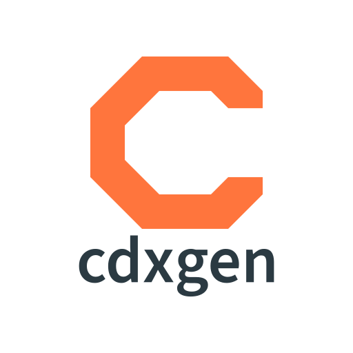
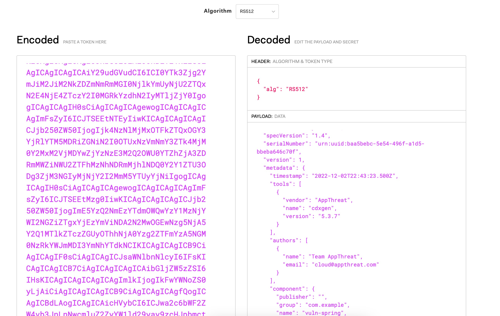

[![JSR][badge-jsr]][jsr-cdxgen]
[![NPM][badge-npm]][npmjs-cdxgen]
[![GitHub Releases][badge-github-releases]][github-releases]
[![NPM Downloads][badge-npm-downloads]][npmjs-cdxgen]
[![GitHub License][badge-github-license]][github-license]
[![GitHub Contributors][badge-github-contributors]][github-contributors]
[![SWH][badge-swh]][swh-cdxgen]

# CycloneDX Generator (cdxgen)



cdxgen is a CLI tool, library, [REPL](./ADVANCED.md), and server to create a valid and compliant [CycloneDX][cyclonedx-homepage] Bill of Materials (BOM) containing an aggregate of all project dependencies in JSON format. CycloneDX is a full-stack BOM specification that is easily created, human and machine-readable, and simple to parse. The tool supports CycloneDX specification versions from 1.4 - 1.6.

Supported BOM formats:

- Software (SBOM) - For many languages and container images.
- Cryptography (CBOM) - For Java and Python projects.
- Operations (OBOM) - For Linux container images and VMs running Linux or Windows operating systems.
- Software-as-a-Service (SaaSBOM) - For Java, Python, JavaScript, TypeScript, and PHP projects.
- Attestations (CDXA) - Generate SBOM with templates for multiple standards. Sign the BOM document at a granular level to improve authenticity.
- Vulnerability Disclosure Report (VDR) - Use cdxgen with [OWASP depscan](https://github.com/owasp-dep-scan/dep-scan) to automate the generation of VDR at scale.

## Why cdxgen?

Most SBOM tools are like simple barcode scanners. For easy applications, they can parse a few package manifests and create a list of components only based on these files without any deep inspection. Further, a typical application might have several repos, components, and libraries with complex build requirements. Traditional techniques to generate an SBOM per language or package manifest either do not work in enterprise environments or don't provide the confidence required for both compliance and automated analysis. So we built cdxgen - the universal polyglot SBOM generator that is user-friendly, precise, and comprehensive!


Our philosophy:

- Explainability: Don't list, but explain with evidence.
- Precision: Try using multiple techniques to improve precision, even if it takes extra time.
- Personas: Cater to the needs of a range of personas such as security researchers, compliance auditors, developers, and SOC.
- Lifecycle: Support BOM generation for various product lifecycles.
- Machine Learning: Optimize the generated data for Machine Learning (ML) purposes by considering the various model properties.

## Documentation

Please visit our [GPT app][cdxgen-gpt] or the [documentation site][docs-homepage] for detailed usage, tutorials, and support documentation.

Sections include:

- [Getting Started][docs-homepage]
- [CLI Usage][docs-cli]
- [Server Usage][docs-server]
- [Supported Project Types][docs-project-types]
- [Environment Variables][docs-env-vars]
- [Advanced Usage][docs-advanced-usage]
- [Permissions][docs-permissions]
- [Support (Enterprise & Community)][docs-support]

## Usage

## Installing

```shell
npm install -g @cyclonedx/cdxgen
```

To run cdxgen without installing (hotloading), use the [pnpm dlx](https://pnpm.io/cli/dlx) command.

```shell
corepack pnpm dlx @cyclonedx/cdxgen --help
```

If you are a [Homebrew][homebrew-homepage] user, you can also install [cdxgen][homebrew-cdxgen] via:

```shell
$ brew install cdxgen
```

If you are a [Winget][winget-homepage] user on windows, you can also install cdxgen via:

```shell
$ winget install cdxgen
```

Deno and bun runtime can be used with limited support.

```shell
deno install --allow-read --allow-env --allow-run --allow-sys=uid,systemMemoryInfo,gid,homedir --allow-write --allow-net -n cdxgen "npm:@cyclonedx/cdxgen/cdxgen"
```

You can also use the cdxgen container image with node, deno, or bun runtime versions.

The default version uses Node.js 23

```bash
docker run --rm -e CDXGEN_DEBUG_MODE=debug -v /tmp:/tmp -v $(pwd):/app:rw -t ghcr.io/cyclonedx/cdxgen:master -r /app -o /app/bom.json
```

To use the deno version, use `ghcr.io/cyclonedx/cdxgen-deno` as the image name.

```bash
docker run --rm -e CDXGEN_DEBUG_MODE=debug -v /tmp:/tmp -v $(pwd):/app:rw -t ghcr.io/cyclonedx/cdxgen-deno:master -r /app -o /app/bom.json
```

For the bun version, use `ghcr.io/cyclonedx/cdxgen-bun` as the image name.

```bash
docker run --rm -e CDXGEN_DEBUG_MODE=debug -v /tmp:/tmp -v $(pwd):/app:rw -t ghcr.io/cyclonedx/cdxgen-bun:master -r /app -o /app/bom.json
```

In deno applications, cdxgen could be directly imported without any conversion. Please see the section on [integration as a library](#integration-as-library)

```ts
import { createBom, submitBom } from "npm:@cyclonedx/cdxgen@^11.0.0";
```

## Getting Help

```text
cdxgen [command]

Commands:
  cdxgen completion  Generate bash/zsh completion

Options:
  -o, --output                 Output file. Default bom.json                                       [default: "bom.json"]
  -t, --type                   Project type. Please refer to https://cyclonedx.github.io/cdxgen/#/PROJECT_TYPES for supp
                               orted languages/platforms.                                                        [array]
      --exclude-type           Project types to exclude. Please refer to https://cyclonedx.github.io/cdxgen/#/PROJECT_TY
                               PES for supported languages/platforms.
  -r, --recurse                Recurse mode suitable for mono-repos. Defaults to true. Pass --no-recurse to disable.
                                                                                               [boolean] [default: true]
  -p, --print                  Print the SBOM as a table with tree.                                            [boolean]
  -c, --resolve-class          Resolve class names for packages. jars only for now.                            [boolean]
      --deep                   Perform deep searches for components. Useful while scanning C/C++ apps, live OS and oci i
                               mages.                                                                          [boolean]
      --server-url             Dependency track url. Eg: https://deptrack.cyclonedx.io
      --skip-dt-tls-check      Skip TLS certificate check when calling Dependency-Track.      [boolean] [default: false]
      --api-key                Dependency track api key
      --project-group          Dependency track project group
      --project-name           Dependency track project name. Default use the directory name
      --project-version        Dependency track project version                                   [string] [default: ""]
      --project-id             Dependency track project id. Either provide the id or the project name and version togeth
                               er                                                                               [string]
      --parent-project-id      Dependency track parent project id                                               [string]
      --required-only          Include only the packages with required scope on the SBOM. Would set compositions.aggrega
                               te to incomplete unless --no-auto-compositions is passed.                       [boolean]
      --fail-on-error          Fail if any dependency extractor fails.                                         [boolean]
      --no-babel               Do not use babel to perform usage analysis for JavaScript/TypeScript projects.  [boolean]
      --generate-key-and-sign  Generate an RSA public/private key pair and then sign the generated SBOM using JSON Web S
                               ignatures.                                                                      [boolean]
      --server                 Run cdxgen as a server                                                          [boolean]
      --server-host            Listen address                                                     [default: "127.0.0.1"]
      --server-port            Listen port                                                             [default: "9090"]
      --install-deps           Install dependencies automatically for some projects. Defaults to true but disabled for c
                               ontainers and oci scans. Use --no-install-deps to disable this feature.         [boolean]
      --validate               Validate the generated SBOM using json schema. Defaults to true. Pass --no-validate to di
                               sable.                                                          [boolean] [default: true]
      --evidence               Generate SBOM with evidence for supported languages.           [boolean] [default: false]
      --spec-version           CycloneDX Specification version to use. Defaults to 1.6           [number] [default: 1.6]
      --filter                 Filter components containing this word in purl or component.properties.value. Multiple va
                               lues allowed.                                                                     [array]
      --only                   Include components only containing this word in purl. Useful to generate BOM with first p
                               arty components alone. Multiple values allowed.                                   [array]
      --author                 The person(s) who created the BOM. Set this value if you're intending the modify the BOM
                               and claim authorship.                               [array] [default: "OWASP Foundation"]
      --profile                BOM profile to use for generation. Default generic.
  [choices: "appsec", "research", "operational", "threat-modeling", "license-compliance", "generic", "machine-learning",
                                                       "ml", "deep-learning", "ml-deep", "ml-tiny"] [default: "generic"]
      --exclude                Additional glob pattern(s) to ignore                                              [array]
      --include-formulation    Generate formulation section with git metadata and build tools. Defaults to false.
                                                                                              [boolean] [default: false]
      --include-crypto         Include crypto libraries as components.                        [boolean] [default: false]
      --standard               The list of standards which may consist of regulations, industry or organizational-specif
                               ic standards, maturity models, best practices, or any other requirements which can be eva
                               luated against or attested to.
  [array] [choices: "asvs-5.0", "asvs-4.0.3", "bsimm-v13", "masvs-2.0.0", "nist_ssdf-1.1", "pcissc-secure-slc-1.1", "scv
                                                                                         s-1.0.0", "ssaf-DRAFT-2023-11"]
      --min-confidence         Minimum confidence needed for the identity of a component from 0 - 1, where 1 is 100% con
                               fidence.                                                            [number] [default: 0]
      --technique              Analysis technique to use
  [array] [choices: "auto", "source-code-analysis", "binary-analysis", "manifest-analysis", "hash-comparison", "instrume
                                                                                                   ntation", "filename"]
      --auto-compositions      Automatically set compositions when the BOM was filtered. Defaults to true
                                                                                               [boolean] [default: true]
  -h, --help                   Show help                                                                       [boolean]
  -v, --version                Show version number                                                             [boolean]
```

All boolean arguments accept `--no` prefix to toggle the behavior.

## Example

Minimal example.

```shell
cdxgen -o bom.json
```

For a java project. cdxgen would automatically detect maven, gradle, or sbt and build bom accordingly

```shell
cdxgen -t java -o bom.json
```

To print the SBOM as a table pass `-p` argument.

```shell
cdxgen -t java -o bom.json -p
```

To recursively generate a single BOM for all languages pass `-r` argument.

```shell
cdxgen -r -o bom.json
```

The default specification used by cdxgen is 1.5. To generate BOM for a different specification version, such as 1.6 or 1.4, pass the version number using the `--spec-version` argument.

```shell
# 1.6 is unsupported by most tools
cdxgen -r -o bom.json --spec-version 1.6

# 1.4 is supported by most tools
cdxgen -r -o bom.json --spec-version 1.4
```

To generate SBOM for C or Python, ensure Java >= 21 is installed.

```shell
# Install java >= 21
cdxgen -t c -o bom.json
```

NOTE: cdxgen is known to freeze with Java 8 or 11, so ensure >= 21 is installed and JAVA_HOME environment variable is configured correctly. If in doubt, use the cdxgen container image.

## Universal SBOM

By passing the type argument `-t universal`, cdxgen could be forced to opportunistically collect as many components and services as possible by scanning all package, container, and Kubernetes manifests. The resulting SBOM could have over a thousand components, thus requiring additional triaging before use with traditional SCA tools.

## SBOM server

Invoke cdxgen with `--server` argument to run it in server mode. By default, it listens to port `9090`, which can be customized with the arguments `--server-host` and `--server-port`.

```shell
cdxgen --server
```

Or use the container image.

```bash
docker run --rm -v /tmp:/tmp -p 9090:9090 -v $(pwd):/app:rw -t ghcr.io/cyclonedx/cdxgen -r /app --server --server-host 0.0.0.0
```

Use curl or your favorite tool to pass arguments to the `/sbom` route.

### Server arguments

Arguments can be passed either via the query string or as a JSON body. Please refer to [Server Usage][docs-server]

### Health endpoint

Use the /health endpoint to check if the SBOM server is up and running.

```shell
curl "http://127.0.0.1:9090/health"
```

### Scanning a local path

```shell
curl "http://127.0.0.1:9090/sbom?path=/Volumes/Work/sandbox/vulnerable-aws-koa-app&multiProject=true&type=js"
```

### Scanning a git repo

```shell
curl "http://127.0.0.1:9090/sbom?url=https://github.com/HooliCorp/vulnerable-aws-koa-app.git&multiProject=true&type=js"
```

If you need to pass credentials to authenticate.

```shell
curl "http://127.0.0.1:9090/sbom?url=https://<access_token>@github.com/some/repo.git&multiProject=true&type=js"
curl "http://127.0.0.1:9090/sbom?url=https://<username>:<password>@bitbucket.org/some/repo.git&multiProject=true&type=js"
```

You can POST the arguments.

```bash
curl -H "Content-Type: application/json" http://localhost:9090/sbom -XPOST -d $'{"url": "https://github.com/HooliCorp/vulnerable-aws-koa-app.git", "type": "nodejs", "multiProject": "true"}'
```

### Docker compose

```shell
git clone https://github.com/cyclonedx/cdxgen.git
docker compose up
```

## War file support

cdxgen can generate a BOM file from a given war file.

```shell
# cdxgen -t java app.war
cdxgen app.war
```

## Resolving class names

Sometimes, it is necessary to resolve class names contained in jar files. By passing an optional argument `--resolve-class`, it is possible to get cdxgen to create a separate mapping file with the jar name (including the version) as the key and class names list as a value.

```shell
cdxgen -t java --resolve-class -o bom.json
```

This would create a bom.json.map file with the jar - class name mapping. Refer to [these](test/data/bom-maven.json.map) [examples](test/data/bom-gradle.json.map) to learn about the structure.

## Resolving licenses

cdxgen can automatically query public registries such as maven, npm, or nuget to resolve the package licenses. This is a time-consuming operation and is disabled by default. To enable, set the environment variable `FETCH_LICENSE` to `true`, as shown. Ensure that `GITHUB_TOKEN` is set or provided by [built-in GITHUB_TOKEN in GitHub Actions][github-rate-limit], otherwise rate limiting might prevent license resolving.

```bash
export FETCH_LICENSE=true
```

## Dependency Tree

cdxgen can retain the dependency tree under the `dependencies` attribute for a small number of supported package manifests. These are currently limited to:

- package-lock.json
- yarn.lock
- pnpm-lock.yaml
- Maven (pom.xml)
- Gradle
- Scala SBT
- Python (requirements.txt, setup.py, pyproject.toml, poetry.lock)
- .NET (packages.lock.json, project.assets.json, paket.lock, .nuspec/.nupkg)
- Go (go.mod)
- PHP (composer.lock)
- Ruby (Gemfile.lock)
- Rust (Cargo.lock)

## Plugins

cdxgen could be extended with external binary plugins to support more SBOM use cases. These are now installed as an optional dependency.

```shell
sudo npm install -g @cyclonedx/cdxgen-plugins-bin
```

## Docker / OCI container support

`docker` type is automatically detected based on the presence of values such as `sha256` or `docker.io` prefix etc in the path.

```shell
cdxgen odoo@sha256:4e1e147f0e6714e8f8c5806d2b484075b4076ca50490577cdf9162566086d15e -o /tmp/bom.json
```

You can also pass `-t docker` with repository names. Only the `latest` tag would be pulled if none was specified.

```shell
cdxgen shiftleft/scan-slim -o /tmp/bom.json -t docker
```

You can also pass the .tar file of a container image.

```shell
docker pull shiftleft/scan-slim
docker save -o /tmp/slim.tar shiftleft/scan-slim
podman save -q --format oci-archive -o /tmp/slim.tar shiftleft/scan-slim
cdxgen /tmp/slim.tar -o /tmp/bom.json -t docker
```

### Podman in rootless mode

Setup podman in either [rootless][podman-github-rootless] or [remote][podman-github-remote] mode

Do not forget to start the podman socket required for API access on Linux.

```shell
systemctl --user enable --now podman.socket
systemctl --user start podman.socket
podman system service -t 0 &
```

## Generate OBOM for a live system

You can use the `obom` command to generate an OBOM for a live system or a VM for compliance and vulnerability management purposes. Windows and Linux operating systems are supported in this mode.

```shell
# obom is an alias for cdxgen -t os
obom
# cdxgen -t os
```

This feature is powered by osquery, which is [installed](https://github.com/cyclonedx/cdxgen-plugins-bin/blob/main/build.sh#L8) along with the binary plugins. cdxgen would opportunistically try to detect as many components, apps, and extensions as possible using the [default queries](data/queries.json). The process would take several minutes and result in an SBOM file with thousands of components of various types, such as operating-system, device-drivers, files, and data.

## Generate Cryptography Bill of Materials (CBOM)

Use the `cbom` alias to generate a CBOM. This is currently supported only for Java projects.

```shell
cbom -t java
# cdxgen -t java --include-crypto -o bom.json .
```

## Generating SaaSBOM and component evidences

See [evinse mode](./ADVANCED.md) in the advanced documentation.

## BOM signing

cdxgen can sign the generated BOM json file to increase authenticity and non-repudiation capabilities. To enable this, set the following environment variables.

- SBOM_SIGN_ALGORITHM: Algorithm. Example: RS512
- SBOM_SIGN_PRIVATE_KEY: Location to the RSA private key
- SBOM_SIGN_PUBLIC_KEY: Optional. Location to the RSA public key

To generate test public/private key pairs, you can run cdxgen by passing the argument `--generate-key-and-sign`. The generated json file would have an attribute called `signature`, which could be used for validation. [jwt.io][jwt-homepage] is a known site that could be used for such signature validation.



### Verifying the signature

Use the bundled `cdx-verify` command, which supports verifying a single signature added at the bom level.

```shell
npm install -g @cyclonedx/cdxgen
cdx-verify -i bom.json --public-key public.key
```

### Custom verification tool (Node.js example)

There are many [libraries][jwt-libraries] available to validate JSON Web Tokens. Below is a javascript example.

```js
# npm install jws
const jws = require("jws");
const fs = require("fs");
// Location of the SBOM json file
const bomJsonFile = "bom.json";
// Location of the public key
const publicKeyFile = "public.key";
const bomJson = JSON.parse(fs.readFileSync(bomJsonFile, "utf8"));
// Retrieve the signature
const bomSignature = bomJson.signature.value;
const validationResult = jws.verify(bomSignature, bomJson.signature.algorithm, fs.readFileSync(publicKeyFile, "utf8"));
if (validationResult) {
  console.log("Signature is valid!");
} else {
  console.log("SBOM signature is invalid :(");
}
```

## Automatic usage detection

For node.js projects, lock files are parsed initially, so the SBOM would include all dependencies, including dev ones. An AST parser powered by babel-parser is then used to detect packages that are imported and used by non-test code. Such imported packages would automatically set their scope property to `required` in the resulting SBOM. You can turn off this analysis by passing the argument `--no-babel`. Scope property would then be set based on the `dev` attribute in the lock file.

This attribute can be later used for various purposes. For example, [dep-scan][depscan-github] uses this attribute to prioritize vulnerabilities. Unfortunately, tools such as dependency track, do not include this feature and might over-report the CVEs.

With the argument `--required-only`, you can limit the SBOM only to include packages with the scope "required", commonly called production or non-dev dependencies. Combine with `--no-babel` to limit this list to only non-dev dependencies based on the `dev` attribute being false in the lock files.

For go, `go mod why` command is used to identify required packages. For php, composer lock file is parsed to distinguish required (packages) from optional (packages-dev).

## Automatic services detection

cdxgen can automatically detect names of services from YAML manifests such as docker-compose, Kubernetes, or Skaffold manifests. These would be populated under the `services` attribute in the generated SBOM. With [evinse](./ADVANCED.md), additional services could be detected by parsing common annotations from the source code.

## Conversion to SPDX format

Use the [CycloneDX CLI][cyclonedx-cli-github] tool for advanced use cases such as conversion, diff and merging.

## Including .NET Global Assembly Cache dependencies in the results

For `dotnet` and `dotnet-framework`, SBOM could include components without a version number. Often, these components begin with the prefix `System.`.

Global Assembly Cache (GAC) dependencies (System Runtime dependencies) must be made available in the build output of the project for version detection. A simple way to have the dotnet build copy the GAC dependencies into the build directory is to place the file `Directory.Build.props` into the root of the project and ensure the contents include the following:

```
<Project xmlns="http://schemas.microsoft.com/developer/msbuild/2003">
<ItemDefinitionGroup>
  <Reference>
    <Private>True</Private>
  </Reference>
</ItemDefinitionGroup>
</Project>
```

Then, run cdxgen cli with the `--deep` argument.

## License

Permission to modify and redistribute is granted under the terms of the Apache 2.0 license. See the [LICENSE][github-license] file for the full license.

## Integration as library

cdxgen is [ESM only](https://gist.github.com/sindresorhus/a39789f98801d908bbc7ff3ecc99d99c) and could be imported and used with both deno and Node.js >= 20

Minimal example:

```ts
import { createBom, submitBom } from "npm:@cyclonedx/cdxgen@^9.0.1";
```

See the [Deno Readme](./contrib/deno/README.md) for detailed instructions.

```javascript
import { createBom, submitBom } from "@cyclonedx/cdxgen";
// bomNSData would contain bomJson
const bomNSData = await createBom(filePath, options);
// Submission to dependency track server
const dbody = await submitBom(args, bomNSData.bomJson);
```

## Contributing

Please check out our [contribute to CycloneDX/cdxgen documentation][github-contribute] if you are interested in helping.

Before raising a PR, please run the following commands.

```bash
corepack enable pnpm
pnpm install
# Generate types using jsdoc syntax
pnpm run gen-types
# Run biomejs formatter and linter with auto fix
pnpm run lint
# Run jest tests
pnpm test
```

## Sponsors


<!-- LINK LABELS -->
<!-- Badges -->

[badge-github-contributors]: https://img.shields.io/github/contributors/cyclonedx/cdxgen
[badge-github-license]: https://img.shields.io/github/license/cyclonedx/cdxgen
[badge-github-releases]: https://img.shields.io/github/v/release/cyclonedx/cdxgen
[badge-jsr]: https://img.shields.io/jsr/v/%40cyclonedx/cdxgen
[badge-npm]: https://img.shields.io/npm/v/%40cyclonedx%2Fcdxgen
[badge-npm-downloads]: https://img.shields.io/npm/dy/%40cyclonedx%2Fcdxgen
[badge-swh]: https://archive.softwareheritage.org/badge/origin/https://github.com/CycloneDX/cdxgen/

<!-- cdxgen github project -->

[github-contribute]: https://github.com/CycloneDX/cdxgen/contribute
[github-contributors]: https://github.com/CycloneDX/cdxgen/graphs/contributors
[github-issues]: https://github.com/CycloneDX/cdxgen/issues
[github-license]: https://github.com/cyclonedx/cdxgen/blob/master/LICENSE
[github-releases]: https://github.com/CycloneDX/cdxgen/releases

<!-- cdxgen documentation site -->

[docs-homepage]: https://cyclonedx.github.io/cdxgen
[docs-advanced-usage]: https://cyclonedx.github.io/cdxgen/#/ADVANCED
[docs-cli]: https://cyclonedx.github.io/cdxgen/#/CLI
[docs-env-vars]: https://cyclonedx.github.io/cdxgen/#/ENV
[docs-permissions]: https://cyclonedx.github.io/cdxgen/#/PERMISSIONS
[docs-project-types]: https://cyclonedx.github.io/cdxgen/#/PROJECT_TYPES
[docs-server]: https://cyclonedx.github.io/cdxgen/#/SERVER
[docs-support]: https://cyclonedx.github.io/cdxgen/#/PROJECT_TYPES

<!-- web links-->

[appthreat-homepage]: https://www.appthreat.com
[cyclonedx-homepage]: https://cyclonedx.org
[cyclonedx-cli-github]: https://github.com/CycloneDX/cyclonedx-cli
[depscan-github]: https://github.com/cyclonedx/dep-scan
[github-rate-limit]: https://docs.github.com/en/rest/overview/rate-limits-for-the-rest-api#primary-rate-limit-for-github_token-in-github-actions
[homebrew-homepage]: https://brew.sh
[homebrew-cdxgen]: https://formulae.brew.sh/formula/cdxgen
[winget-homepage]: https://learn.microsoft.com/en-us/windows/package-manager/winget/
[jsr-cdxgen]: https://jsr.io/@cyclonedx/cdxgen
[jwt-homepage]: https://jwt.io
[jwt-libraries]: https://jwt.io/libraries
[librariesio]: https://libraries.io/npm/@cyclonedx%2Fcdxgen
[npmjs-cdxgen]: https://www.npmjs.com/package/@cyclonedx/cdxgen
[podman-github-rootless]: https://github.com/containers/podman/blob/master/docs/tutorials/rootless_tutorial.md
[podman-github-remote]: https://github.com/containers/podman/blob/master/docs/tutorials/mac_win_client.md
[swh-cdxgen]: https://archive.softwareheritage.org/browse/origin/?origin_url=https://github.com/CycloneDX/cdxgen
[cdxgen-gpt]: https://chatgpt.com/g/g-673bfeb4037481919be8a2cd1bf868d2-cyclonedx-generator-cdxgen
