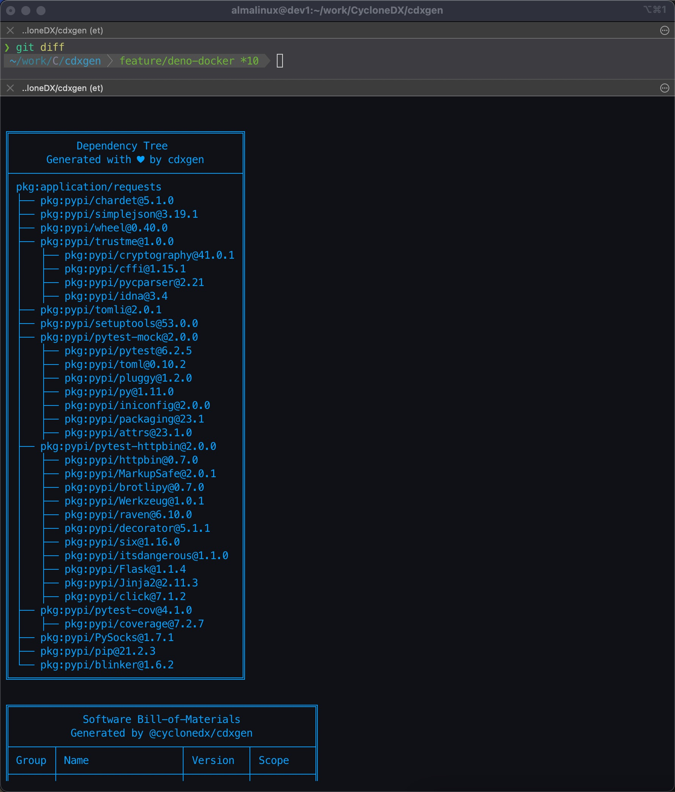

# CycloneDX Generator


cdxgen is a cli tool, library, [REPL](./ADVANCED.md), and server to create a valid and compliant [CycloneDX][cyclonedx-homepage] Software Bill-of-Materials (SBOM) containing an aggregate of all project dependencies for c/c++, node.js, php, python, ruby, rust, java, .Net, dart, haskell, elixir, and Go projects in JSON format. CycloneDX 1.5 is a lightweight SBOM specification that is easily created, human and machine-readable, and simple to parse.

When used with plugins, cdxgen could generate an OBoM for Linux docker images and even VMs running Linux or Windows operating systems. cdxgen also includes an evinse tool to generate component evidence and SaaSBoM for some languages.

NOTE:

CycloneDX 1.5 specification is new and unsupported by many downstream tools. Use version 8.6.0 for 1.4 compatibility or pass the argument `--spec-version 1.4`.

## Why cdxgen?

A typical application might have several repos, components, and libraries. Traditional techniques to generate a single SBoM per language or package manifest do not work in enterprise environments. So we built cdxgen - the universal polyglot SBoM generator!


## Supported languages and package format

| Language/Platform               | Package format                                                                                                    | Transitive dependencies                                                                           |
| ------------------------------- | ----------------------------------------------------------------------------------------------------------------- | ------------------------------------------------------------------------------------------------- |
| node.js                         | npm-shrinkwrap.json, package-lock.json, pnpm-lock.yaml, yarn.lock, rush.js, bower.json, .min.js                   | Yes except .min.js                                                                                |
| java                            | maven (pom.xml [1]), gradle (build.gradle, .kts), scala (sbt), bazel                                              | Yes unless pom.xml is manually parsed due to unavailability of maven or errors                    |
| php                             | composer.lock                                                                                                     | Yes                                                                                               |
| python                          | pyproject.toml, setup.py, requirements.txt [2], Pipfile.lock, poetry.lock, pdm.lock, bdist_wheel, .whl, .egg-info | Yes using the automatic pip install/freeze. When disabled, only with Pipfile.lock and poetry.lock |
| go                              | binary, go.mod, go.sum, Gopkg.lock                                                                                | Yes except binary                                                                                 |
| ruby                            | Gemfile.lock, gemspec                                                                                             | Only for Gemfile.lock                                                                             |
| rust                            | binary, Cargo.toml, Cargo.lock                                                                                    | Only for Cargo.lock                                                                               |
| .Net                            | .csproj, packages.config, project.assets.json [3], packages.lock.json, .nupkg, paket.lock                         | Only for project.assets.json, packages.lock.json                                                  |
| dart                            | pubspec.lock, pubspec.yaml                                                                                        | Only for pubspec.lock                                                                             |
| haskell                         | cabal.project.freeze                                                                                              | Yes                                                                                               |
| elixir                          | mix.lock                                                                                                          | Yes                                                                                               |
| c/c++/Objective C/c++11         | conan.lock, conanfile.txt, \*.cmake, CMakeLists.txt, meson.build, codebase without package managers!              | Yes only for conan.lock. Best effort basis for cmake without version numbers.                     |
| clojure                         | Clojure CLI (deps.edn), Leiningen (project.clj)                                                                   | Yes unless the files are parsed manually due to lack of clojure cli or leiningen command          |
| swift                           | Package.resolved, Package.swift (swiftpm)                                                                         | Yes                                                                                               |
| docker / oci image              | All supported languages. Linux OS packages with plugins [4]                                                       | Best effort based on lock files                                                                   |
| GitHub Actions                  | .github/workflows/\*.yml                                                                                          | N/A                                                                                               |
| Linux                           | All supported languages. Linux OS packages with plugins [5]                                                       | Best effort based on lock files                                                                   |
| Windows                         | All supported languages. OS packages with best effort [5]                                                         | Best effort based on lock files                                                                   |
| Jenkins Plugins                 | .hpi files                                                                                                        |                                                                                                   |
| Helm Charts                     | .yaml                                                                                                             | N/A                                                                                               |
| Skaffold                        | .yaml                                                                                                             | N/A                                                                                               |
| kustomization                   | .yaml                                                                                                             | N/A                                                                                               |
| Tekton tasks                    | .yaml                                                                                                             | N/A                                                                                               |
| Kubernetes                      | .yaml                                                                                                             | N/A                                                                                               |
| Maven Cache                     | $HOME/.m2/repository/\*\*/\*.jar                                                                                  | N/A                                                                                               |
| SBT Cache                       | $HOME/.ivy2/cache/\*\*/\*.jar                                                                                     | N/A                                                                                               |
| Gradle Cache                    | $HOME/caches/modules-2/files-2.1/\*\*/\*.jar                                                                      | N/A                                                                                               |
| Helm Index                      | $HOME/.cache/helm/repository/\*\*/\*.yaml                                                                         | N/A                                                                                               |
| Docker compose                  | docker-compose\*.yml. Images would also be scanned.                                                               | N/A                                                                                               |
| Google CloudBuild configuration | cloudbuild.yaml                                                                                                   | N/A                                                                                               |
| OpenAPI                         | openapi\*.json, openapi\*.yaml                                                                                    | N/A                                                                                               |

NOTE:

- Apache maven 3.x is required for parsing pom.xml
- gradle or gradlew is required to parse gradle projects
- sbt is required for parsing scala sbt projects. Only scala 2.10 + sbt 0.13.6+ and 2.12 + sbt 1.0+ are currently supported.
  - Alternatively, create a lock file using sbt-dependency-lock [plugin](https://github.com/stringbean/sbt-dependency-lock)

Footnotes:

- [1] - For multi-module applications, the BoM file could include components not included in the packaged war or ear file.
- [2] - Pip freeze is automatically performed to improve precision. Requires virtual environment.
- [3] - Perform dotnet or nuget restore to generate project.assets.json. Without this file, cdxgen would not include indirect dependencies.
- [4] - See the section on plugins
- [5] - Powered by osquery. See the section on plugins



### Automatic usage detection

For node.js projects, lock files are parsed initially, so the SBoM would include all dependencies, including dev ones. An AST parser powered by babel-parser is then used to detect packages that are imported and used by non-test code. Such imported packages would automatically set their scope property to `required` in the resulting SBoM. You can turn off this analysis by passing the argument `--no-babel`. Scope property would then be set based on the `dev` attribute in the lock file.

This attribute can be later used for various purposes. For example, [dep-scan](https://github.com/cyclonedx/dep-scan) uses this attribute to prioritize vulnerabilities. Unfortunately, tools such as dependency track, do not include this feature and might over-report the CVEs.

By passing the argument `--required-only`, you can limit the SBoM only to include packages with the scope "required", commonly called production or non-dev dependencies. Combine with `--no-babel` to limit this list to only non-dev dependencies based on the `dev` attribute being false in the lock files.

For go, `go mod why` command is used to identify required packages. For php, composer lock file is parsed to distinguish required (packages) from optional (packages-dev).

## Usage

## Installing

```shell
sudo npm install -g @cyclonedx/cdxgen

# For CycloneDX 1.4 compatibility use version 8.6.0 or pass the argument `--spec-version 1.4`
sudo npm install -g @cyclonedx/cdxgen@8.6.0
```

If you are a [Homebrew](https://brew.sh/) user, you can also install [cdxgen](https://formulae.brew.sh/formula/cdxgen) via:

```shell
$ brew install cdxgen
```

Deno install is also supported.

```shell
deno install --allow-read --allow-env --allow-run --allow-sys=uid,systemMemoryInfo,gid --allow-write --allow-net -n cdxgen "npm:@cyclonedx/cdxgen/cdxgen"
```

You can also use the cdxgen container image

```bash
docker run --rm -v /tmp:/tmp -v $(pwd):/app:rw -t ghcr.io/cyclonedx/cdxgen -r /app -o /app/bom.json

docker run --rm -v /tmp:/tmp -v $(pwd):/app:rw -t ghcr.io/cyclonedx/cdxgen:v8.6.0 -r /app -o /app/bom.json
```

To use the deno version, use `ghcr.io/cyclonedx/cdxgen-deno` as the image name.

```bash
docker run --rm -v /tmp:/tmp -v $(pwd):/app:rw -t ghcr.io/cyclonedx/cdxgen-deno -r /app -o /app/bom.json
```

In deno applications, cdxgen could be directly imported without any conversion. Please see the section on [integration as library](#integration-as-library)

```ts
import { createBom, submitBom } from "npm:@cyclonedx/cdxgen@^9.0.1";
```

## Getting Help

```text
$ cdxgen -h
  -o, --output                 Output file for bom.xml or bom.json. Default bom.
                               json
  -t, --type                   Project type
  -r, --recurse                Recurse mode suitable for mono-repos. Defaults to
                                true. Pass --no-recurse to disable.
                                                       [boolean] [default: true]
  -p, --print                  Print the SBoM as a table with tree.    [boolean]
  -c, --resolve-class          Resolve class names for packages. jars only for n
                               ow.                                     [boolean]
      --deep                   Perform deep searches for components. Useful whil
                               e scanning C/C++ apps, live OS and oci images.
                                                                       [boolean]
      --server-url             Dependency track url. Eg: https://deptrack.cyclon
                               edx.io
      --api-key                Dependency track api key
      --project-group          Dependency track project group
      --project-name           Dependency track project name. Default use the di
                               rectory name
      --project-version        Dependency track project version    [default: ""]
      --project-id             Dependency track project id. Either provide the i
                               d or the project name and version together
      --parent-project-id      Dependency track parent project id
      --required-only          Include only the packages with required scope on
                               the SBoM.                               [boolean]
      --fail-on-error          Fail if any dependency extractor fails. [boolean]
      --no-babel               Do not use babel to perform usage analysis for Ja
                               vaScript/TypeScript projects.           [boolean]
      --generate-key-and-sign  Generate an RSA public/private key pair and then
                               sign the generated SBoM using JSON Web Signatures
                               .                                       [boolean]
      --server                 Run cdxgen as a server                  [boolean]
      --server-host            Listen address             [default: "127.0.0.1"]
      --server-port            Listen port                     [default: "9090"]
      --install-deps           Install dependencies automatically for some proje
                               cts. Defaults to true but disabled for containers
                                and oci scans. Use --no-install-deps to disable
                               this feature.           [boolean] [default: true]
      --validate               Validate the generated SBoM using json schema. De
                               faults to true. Pass --no-validate to disable.
                                                       [boolean] [default: true]
      --usages-slices-file     Path for the usages slice file created by atom.
      --data-flow-slices-file  Path for the data-flow slice file created by atom
                               .
      --spec-version           CycloneDX Specification version to use. Defaults
                               to 1.5                             [default: 1.5]
  -h, --help                   Show help                               [boolean]
  -v, --version                Show version number                     [boolean]
```

All boolean arguments accept `--no` prefix to toggle the behavior.

## Example

Minimal example.

```shell
cdxgen -o bom.json
```

For a java project. cdxgen would automatically detect maven, gradle, or sbt and build bom accordingly

```shell
cdxgen -t java -o bom.json
```

To print the SBoM as a table pass `-p` argument.

```shell
cdxgen -t java -o bom.json -p
```

To recursively generate a single BoM for all languages pass `-r` argument.

```shell
cdxgen -r -o bom.json
```

To generate SBoM for an older specification version, such as 1.4, pass the version number using the `--spec-version` argument.

```shell
cdxgen -r -o bom.json --spec-version 1.4
```

To generate SBoM for C or Python, ensure Java >= 17 is installed.

```shell
# Install java >= 17
cdxgen -t c -o bom.json
```

NOTE: cdxgen is known to freeze with Java 8 or 11, so ensure >= 17 is installed and JAVA_HOME environment variable is configured correctly. If in doubt, use the cdxgen container image.

## Universal SBoM

By passing the type argument `-t universal`, cdxgen could be forced to opportunistically collect as many components and services as possible by scanning all package, container, and Kubernetes manifests. The resulting SBoM could have over a thousand components, thus requiring additional triaging before use with traditional SCA tools.

## SBoM server

Invoke cdxgen with `--server` argument to run it in server mode. By default, it listens to port `9090`, which can be customized with the arguments `--server-host` and `--server-port`.

```shell
cdxgen --server
```

Or use the container image.

```bash
docker run --rm -v /tmp:/tmp -p 9090:9090 -v $(pwd):/app:rw -t ghcr.io/cyclonedx/cdxgen -r /app --server --server-host 0.0.0.0
```

Use curl or your favorite tool to pass arguments to the `/sbom` route.

### Server arguments

Arguments can be passed either via the query string or as a JSON body. The following arguments are supported.

| Argument       | Description                                                                                                                                 |
| -------------- | ------------------------------------------------------------------------------------------------------------------------------------------- |
| type           | Project type                                                                                                                                |
| multiProject   | [boolean]                                                                                                                                   |
| requiredOnly   | Include only the packages with required scope on the SBoM. [boolean]                                                                        |
| noBabel        | Do not use babel to perform usage analysis for JavaScript/TypeScript projects. [boolean]                                                    |
| installDeps    | Install dependencies automatically for some projects. Defaults to true but disabled for containers and oci scans. [boolean] [default: true] |
| project        |                                                                                                                                             |
| projectName    | Dependency track project name. Default use the directory name                                                                               |
| projectGroup   | Dependency track project group                                                                                                              |
| projectVersion | Dependency track project version [default: ""]                                                                                              |

### Scanning a local path

```shell
curl "http://127.0.0.1:9090/sbom?path=/Volumes/Work/sandbox/vulnerable-aws-koa-app&multiProject=true&type=js"
```

### Scanning a git repo

```shell
curl "http://127.0.0.1:9090/sbom?url=https://github.com/HooliCorp/vulnerable-aws-koa-app.git&multiProject=true&type=js"
```

You can POST the arguments.

```bash
curl -H "Content-Type: application/json" http://localhost:9090/sbom -XPOST -d $'{"url": "https://github.com/HooliCorp/vulnerable-aws-koa-app.git", "type": "nodejs", "multiProject": "true"}'
```

### Docker compose

```shell
git clone https://github.com/cyclonedx/cdxgen.git
docker compose up
```

## War file support

cdxgen can generate a BoM file from a given war file.

```shell
# cdxgen -t java app.war
cdxgen app.war
```

## Resolving class names

Sometimes, it is necessary to resolve class names contained in jar files. By passing an optional argument `--resolve-class`, it is possible to get cdxgen to create a separate mapping file with the jar name (including the version) as the key and class names list as a value.

```shell
cdxgen -t java --resolve-class -o bom.json
```

This would create a bom.json.map file with the jar - class name mapping. Refer to [these](test/data/bom-maven.json.map) [examples](test/data/bom-gradle.json.map) to learn about the structure.

## Resolving licenses

cdxgen can automatically query public registries such as maven, npm, or nuget to resolve the package licenses. This is a time-consuming operation and is disabled by default. To enable, set the environment variable `FETCH_LICENSE` to `true`, as shown.

```bash
export FETCH_LICENSE=true
```

## Dependency Tree

cdxgen can retain the dependency tree under the `dependencies` attribute for a small number of supported package manifests. These are currently limited to:

- package-lock.json
- yarn.lock
- pnpm-lock.yaml
- Maven (pom.xml)
- Gradle
- Scala SBT
- Python (requirements.txt, setup.py, pyproject.toml, poetry.lock)
- csharp (projects.assets.json)

## Environment variables

| Variable                     | Description                                                                                                                          |
| ---------------------------- | ------------------------------------------------------------------------------------------------------------------------------------ |
| CDXGEN_DEBUG_MODE            | Set to `debug` to enable debug messages                                                                                              |
| GITHUB_TOKEN                 | Specify GitHub token to prevent traffic shaping while querying license and repo information                                          |
| MVN_CMD                      | Set to override maven command                                                                                                        |
| MVN_ARGS                     | Set to pass additional arguments such as profile or settings to maven                                                                |
| MAVEN_HOME                   | Specify maven home                                                                                                                   |
| MAVEN_CENTRAL_URL            | Specify URL of Maven Central for metadata fetching (e.g. when private repo is used)                                                  |
| BAZEL_TARGET                 | Bazel target to build. Default :all (Eg: //java-maven)                                                                               |
| BAZEL_STRIP_MAVEN_PREFIX     | Strip Maven group prefix (e.g. useful when private repo is used, defaults to `/maven2/`)                                             |
| BAZEL_USE_ACTION_GRAPH       | SBOM for specific Bazel target, uses `bazel aquery 'outputs(".*.jar", deps(<BAZEL_TARGET>))'` (defaults to `false`)                  |
| GRADLE_CACHE_DIR             | Specify gradle cache directory. Useful for class name resolving                                                                      |
| GRADLE_MULTI_PROJECT_MODE    | Unused. Automatically handled                                                                                                        |
| GRADLE_ARGS                  | Set to pass additional arguments such as profile or settings to gradle (all tasks). Eg: --configuration runtimeClassPath             |
| GRADLE_ARGS_PROPERTIES       | Set to pass additional arguments only to the `gradle properties` task, used for collecting metadata about the project                |
| GRADLE_ARGS_DEPENDENCIES     | Set to pass additional arguments only to the `gradle dependencies` task, used for listing actual project dependencies                |
| GRADLE_HOME                  | Specify gradle home                                                                                                                  |
| GRADLE_CMD                   | Set to override gradle command                                                                                                       |
| GRADLE_DEPENDENCY_TASK       | By default cdxgen use the task "dependencies" to collect packages. Set to override the task name.                                    |
| SBT_CACHE_DIR                | Specify sbt cache directory. Useful for class name resolving                                                                         |
| FETCH_LICENSE                | Set this variable to `true` or `1` to fetch license information from the registry. npm and golang                                    |
| USE_GOSUM                    | Set to `true` or `1` to generate BOMs for golang projects using go.sum as the dependency source of truth, instead of go.mod          |
| CDXGEN_TIMEOUT_MS            | Default timeout for known execution involving maven, gradle or sbt                                                                   |
| CDXGEN_SERVER_TIMEOUT_MS     | Default timeout in server mode                                                                                                       |
| CLJ_CMD                      | Set to override the clojure cli command                                                                                              |
| LEIN_CMD                     | Set to override the leiningen command                                                                                                |
| SBOM_SIGN_ALGORITHM          | Signature algorithm. Some valid values are RS256, RS384, RS512, PS256, PS384, PS512, ES256 etc                                       |
| SBOM_SIGN_PRIVATE_KEY        | Private key to use for signing                                                                                                       |
| SBOM_SIGN_PUBLIC_KEY         | Optional. Public key to include in the SBoM signature                                                                                |
| CDX_MAVEN_PLUGIN             | CycloneDX Maven plugin to use. Default "org.cyclonedx:cyclonedx-maven-plugin:2.7.8"                                                  |
| CDX_MAVEN_GOAL               | CycloneDX Maven plugin goal to use. Default makeAggregateBom. Other options: makeBom, makePackageBom                                 |
| CDX_MAVEN_INCLUDE_TEST_SCOPE | Whether test scoped dependencies should be included from Maven projects, Default: true                                               |
| ASTGEN_IGNORE_DIRS           | Comma separated list of directories to ignore while analyzing using babel. The environment variable is also used by atom and astgen. |
| ASTGEN_IGNORE_FILE_PATTERN   | Ignore regex to use                                                                                                                  |

## Plugins

cdxgen could be extended with external binary plugins to support more SBoM use cases. These are now installed as an optional dependency.

```shell
sudo npm install -g @cyclonedx/cdxgen-plugins-bin
```

### Docker / OCI container support

`docker` type is automatically detected based on the presence of values such as `sha256` or `docker.io` prefix etc in the path.

```shell
cdxgen odoo@sha256:4e1e147f0e6714e8f8c5806d2b484075b4076ca50490577cdf9162566086d15e -o /tmp/bom.json
```

You can also pass `-t docker` for simple labels. Only the `latest` tag would be pulled if none was specified.

```shell
cdxgen shiftleft/scan-slim -o /tmp/bom.json -t docker
```

You can also pass the .tar file of a container image.

```shell
docker pull shiftleft/scan-slim
docker save -o /tmp/slim.tar shiftleft/scan-slim
podman save -q --format oci-archive -o /tmp/slim.tar shiftleft/scan-slim
cdxgen /tmp/slim.tar -o /tmp/bom.json -t docker
```

### Podman in rootless mode

Setup podman in either [rootless](https://github.com/containers/podman/blob/master/docs/tutorials/rootless_tutorial.md) or [remote](https://github.com/containers/podman/blob/master/docs/tutorials/mac_win_client.md) mode

Do not forget to start the podman socket required for API access on Linux.

```shell
systemctl --user enable --now podman.socket
systemctl --user start podman.socket
podman system service -t 0 &
```

### Generate OBoM for a live system

You can use the `obom` command to generate an OBoM for a live system or a VM for compliance and vulnerability management purposes. Windows and Linux operating systems are supported in this mode.

```shell
# obom is an alias for cdxgen -t os
obom
# cdxgen -t os
```

This feature is powered by osquery, which is [installed](https://github.com/cyclonedx/cdxgen-plugins-bin/blob/main/build.sh#L8) along with the binary plugins. cdxgen would opportunistically try to detect as many components, apps, and extensions as possible using the [default queries](queries.json). The process would take several minutes and result in an SBoM file with thousands of components of various types, such as operating-system, device-drivers, files, and data.

## Generating SaaSBoM and component evidences

See [evinse mode](./ADVANCED.md) in the advanced documentation.

## BoM signing

cdxgen can sign the generated BoM json file to increase authenticity and non-repudiation capabilities. To enable this, set the following environment variables.

- SBOM_SIGN_ALGORITHM: Algorithm. Example: RS512
- SBOM_SIGN_PRIVATE_KEY: Location to the RSA private key
- SBOM_SIGN_PUBLIC_KEY: Optional. Location to the RSA public key

To generate test public/private key pairs, you can run cdxgen by passing the argument `--generate-key-and-sign`. The generated json file would have an attribute called `signature`, which could be used for validation. [jwt.io](https://jwt.io) is a known site that could be used for such signature validation.


### Verifying the signature

Use the bundled `cdx-verify` command, which supports verifying a single signature added at the bom level.

```shell
npm install -g @cyclonedx/cdxgen
cdx-verify -i bom.json --public-key public.key
```

### Custom verification tool (Node.js example)

There are many [libraries](https://jwt.io/#libraries-io) available to validate JSON Web Tokens. Below is a javascript example.

```js
# npm install jws
const jws = require("jws");
const fs = require("fs");
// Location of the SBoM json file
const bomJsonFile = "bom.json";
// Location of the public key
const publicKeyFile = "public.key";
const bomJson = JSON.parse(fs.readFileSync(bomJsonFile, "utf8"));
// Retrieve the signature
const bomSignature = bomJson.signature.value;
const validationResult = jws.verify(bomSignature, bomJson.signature.algorithm, fs.readFileSync(publicKeyFile, "utf8"));
if (validationResult) {
  console.log("Signature is valid!");
} else {
  console.log("SBoM signature is invalid :(");
}
```

## Automatic services detection

cdxgen can automatically detect names of services from YAML manifests such as docker-compose, Kubernetes, or Skaffold manifests. These would be populated under the `services` attribute in the generated SBoM. With [evinse](./ADVANCED.md), additional services could be detected by parsing common annotations from the source code.

## Conversion to SPDX format

Use the [CycloneDX CLI](https://github.com/CycloneDX/cyclonedx-cli) tool for advanced use cases such as conversion, diff and merging.

## License

Permission to modify and redistribute is granted under the terms of the Apache 2.0 license. See the [LICENSE](LICENSE) file for the full license.

[license]: https://github.com/cyclonedx/cdxgen/blob/master/LICENSE
[cyclonedx-homepage]: https://cyclonedx.org

## Integration as library

cdxgen is [ESM only](https://gist.github.com/sindresorhus/a39789f98801d908bbc7ff3ecc99d99c) and could be imported and used with both deno and Node.js >= 16

Minimal example:

```ts
import { createBom, submitBom } from "npm:@cyclonedx/cdxgen@^9.0.1";
```

See the [Deno Readme](./contrib/deno/README.md) for detailed instructions.

```javascript
import { createBom, submitBom } from "@cyclonedx/cdxgen";
// bomNSData would contain bomJson, bomXml
const bomNSData = await createBom(filePath, options);
// Submission to dependency track server
const dbody = await submitBom(args, bomNSData.bomJson);
```

## Node.js >= 20 permission model

Refer to the [permissions document](./docs/PERMISSIONS.md)

## Contributing

Follow the usual PR process, but before raising a PR, run the following commands.

```bash
npm run lint
npm run pretty
npm test
```

## Enterprise support

Enterprise support, including custom development and integration services, is available via [AppThreat Ltd](https://www.appthreat.com). Free community support is also available via [Discord](https://discord.gg/tmmtjCEHNV).
