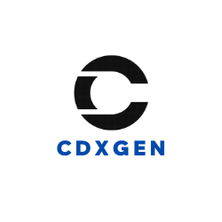

# CycloneDX Generator



This tool creates a valid and compliant CycloneDX Software Bill-of-Materials (SBOM) containing an aggregate of all project dependencies for c/c++, node.js, php, python, ruby, rust, java, .Net, dart, haskell, elixir, and Go projects in XML and JSON format. CycloneDX 1.4 is a lightweight SBOM specification that is easily created, human and machine-readable, and simple to parse.

When used with plugins, cdxgen could generate an SBoM for Linux docker images and even VMs running Linux or Windows operating system.

## Supported languages and package format

| Language/Platform                                      | Package format                                                                                  | Transitive dependencies                                                                  |
| ------------------------------------------------------ | ----------------------------------------------------------------------------------------------- | ---------------------------------------------------------------------------------------- |
| node.js                                                | npm-shrinkwrap.json, package-lock.json, pnpm-lock.yaml, yarn.lock, rush.js, bower.json, .min.js | Yes except .min.js                                                                       |
| java                                                   | maven (pom.xml [1]), gradle (build.gradle, .kts), scala (sbt), bazel                            | Yes unless pom.xml is manually parsed due to unavailability of maven or errors           |
| php                                                    | composer.lock                                                                                   | Yes                                                                                      |
| python                                                 | setup.py, requirements.txt [2], Pipfile.lock, poetry.lock, bdist_wheel, .whl, .egg-info         | Only with Pipfile.lock and poetry.lock                                                   |
| go                                                     | binary, go.mod, go.sum, Gopkg.lock                                                              | Yes except binary                                                                        |
| ruby                                                   | Gemfile.lock, gemspec                                                                           | Only for Gemfile.lock                                                                    |
| rust                                                   | binary, Cargo.toml, Cargo.lock                                                                  | Only for Cargo.lock                                                                      |
| .Net                                                   | .csproj, packages.config, project.assets.json [3], packages.lock.json, .nupkg                   | Only for project.assets.json, packages.lock.json                                         |
| dart                                                   | pubspec.lock, pubspec.yaml                                                                      | Only for pubspec.lock                                                                    |
| haskell                                                | cabal.project.freeze                                                                            | Yes                                                                                      |
| elixir                                                 | mix.lock                                                                                        | Yes                                                                                      |
| c/c++                                                  | conan.lock, conanfile.txt                                                                       | Yes only for conan.lock                                                                  |
| clojure                                                | Clojure CLI (deps.edn), Leiningen (project.clj)                                                 | Yes unless the files are parsed manually due to lack of clojure cli or leiningen command |
| docker / oci image                                     | All supported languages. Linux OS packages with plugins [4]                                     | Best effort based on lock files                                                          |
| GitHub Actions                                         | .github/workflows/\*.yml                                                                        | N/A                                                                                      |
| Linux                                                  | All supported languages. Linux OS packages with plugins [5]                                     | Best effort based on lock files                                                          |
| Windows                                                | All supported languages. OS packages with best effort [5]                                       | Best effort based on lock files                                                          |
| Jenkins Plugins                                        | .hpi files                                                                                      |                                                                                          |
| Helm Charts                                            | .yaml                                                                                           | N/A                                                                                      |
| Skaffold                                               | .yaml                                                                                           | N/A                                                                                      |
| kustomization                                          | .yaml                                                                                           | N/A                                                                                      |
| Tekton tasks                                           | .yaml                                                                                           | N/A                                                                                      |
| Kubernetes                                             | .yaml                                                                                           | N/A                                                                                      |
| Maven Cache                                            | $HOME/.m2/repository/\*\*/\*.jar                                                                | N/A                                                                                      |
| SBT Cache                                              | $HOME/.ivy2/cache/\*\*/\*.jar                                                                   | N/A                                                                                      |
| Gradle Cache                                           | $HOME/caches/modules-2/files-2.1/\*\*/\*.jar                                                    | N/A                                                                                      |
| Helm Index                                             | $HOME/.cache/helm/repository/\*\*/\*.yaml                                                       | N/A                                                                                      |
| Docker compose                                         | docker-compose\*.yml. Images would also be scanned.                                             | N/A                                                                                      |
| Google CloudBuild configuration                        | cloudbuild.yaml                                                                                 | N/A                                                                                      |
| OpenAPI                                                | openapi\*.json, openapi\*.yaml                                                                  | N/A                                                                                      |
| [Privado](https://www.privado.ai?utm_source=AppThreat) | privado.json                                                                                    | Data and service information will be included. Use with universal mode.                  |

NOTE:

- Apache maven 3.x is required for parsing pom.xml
- gradle or gradlew is required to parse gradle projects
- sbt is required for parsing scala sbt projects. Only scala 2.10 + sbt 0.13.6+ and 2.12 + sbt 1.0+ is supported for now.
  - Alternatively, create a lock file using sbt-dependency-lock [plugin](https://github.com/stringbean/sbt-dependency-lock)

Footnotes:

- [1] - For multi-module application, the BoM file could include components that may not be included in the packaged war or ear file.
- [2] - Use pip freeze to improve the accuracy for requirements.txt based parsing. `python -m pip freeze > requirements.txt`
- [3] - Perform dotnet or nuget restore to generate project.assets.json. Without this file cdxgen would not include indirect dependencies.
- [4] - See section on plugins
- [5] - Powered by osquery. See section on plugins

### Automatic usage detection

For node.js projects, lock files are parsed initially so the SBoM would include all dependencies including dev dependencies. An AST parser powered by babel-parser is then used to detect packages that are imported and used by non-test code. Such imported packages would automatically have their `scope` property set to `required` in the resulting SBoM. By passing the argument `--no-babel`, you can disable this analysis. Scope property would then be set based on the `dev` attribute in the lock file.

This attribute can be later used for various purposes. For example, [dep-scan](https://github.com/appthreat/dep-scan) use this attribute to prioritize vulnerabilities. Tools such dependency track, unfortunately, do not include this feature and hence might over-report the CVEs.

By passing the argument `--required-only`, you can limit the SBoM to only include packages with the scope "required", commonly referred to as production or non-dev dependencies. Combine with `--no-babel` to limit this list to only non-dev dependencies based on the `dev` attribute being false in the lock files.

For go, `go mod why` command is used to identify required packages. For php, composer lock file is used to distinguish required (packages) from optional (packages-dev).

## Usage

## Installing

```bash
sudo npm install -g @appthreat/cdxgen
```

You can also use the cdxgen container image

```bash
docker run --rm -it -v /tmp:/tmp -v $(pwd):/app:rw -t ghcr.io/appthreat/cdxgen -r /app
```

## Getting Help

```bash
$ cdxgen -h
Options:
  -o, --output           Output file for bom.xml or bom.json. Default console
  -t, --type             Project type
  -r, --recurse          Recurse mode suitable for mono-repos          [boolean]
  -p, --print            Print the SBoM as a table                     [boolean]
  -c, --resolve-class    Resolve class names for packages. jars only for now.
                                                                       [boolean]
      --deep             Perform deep searches for components. Useful while
                         scanning live OS and oci images.              [boolean]
      --server-url       Dependency track or AppThreat server url. Eg:
                         https://deptrack.appthreat.io
      --api-key          Dependency track or AppThreat server api key
      --project-group    Dependency track or AppThreat project group
      --project-name     Dependency track or AppThreat project name. Default use
                         the directory name
      --project-version  Dependency track or AppThreat project version
      --project-id       Dependency track or AppThreat project id. Either
                         provide the id or the project name and version together
      --required-only    Include only the packages with required scope on the
                         SBoM.                                         [boolean]
      --fail-on-error    Fail if any dependency extractor fails.       [boolean]
      --no-babel         Do not use babel to perform usage analysis for
                         JavaScript/TypeScript projects.               [boolean]
      --generate-key-and-sign  Generate an RSA public/private key pair and then
                               sign the generated SBoM using JSON Web
                               Signatures.                             [boolean]
      --server                 Run cdxgen as a server                  [boolean]
      --server-host            Listen address             [default: "127.0.0.1"]
      --server-port            Listen port                     [default: "9090"]
      --version          Show version number                           [boolean]
  -h                     Show help                                     [boolean]
```

## Example

Minimal example.

```bash
cdxgen -o bom.json
```

NOTE:

cdxgen would always produce bom in both xml and json format as per CycloneDX 1.4 specification. json is the recommended format.

For a java project. This would automatically detect maven, gradle or sbt and build bom accordingly

```bash
cdxgen -t java -o bom.json
```

To print the SBoM as a table pass `-p` argument.

```bash
cdxgen -t java -o bom.json -p
```

To recursively generate a single BoM for all languages pass `-r` argument.

```bash
cdxgen -r -o bom.json
```

## Universal SBoM

By passing the type `-t universal`, cdxgen could be forced to opportunistically collect as many components and services as possible by scanning all package, container and kubernetes manifests. The resulting SBoM could have over thousand components thus requiring additional triaging before use with traditional SCA tools.

## SBoM server

Invoke cdxgen with `--server` argument to run it in a server mode. By default, it listens to port `9090` which can be customized with the arguments `--server-host` and `--server-port`.

```bash
cdxgen --server
```

Or use the container image.

```bash
docker run --rm -it -v /tmp:/tmp -p 9090:9090 -v $(pwd):/app:rw -t ghcr.io/appthreat/cdxgen -r /app --server
```

Use curl or your favourite tool to pass arguments to the `/sbom` route.

### Scanning a local path

```bash
curl "http://127.0.0.1:9090/sbom?path=/Volumes/Work/sandbox/vulnerable-aws-koa-app&multiProject=true&type=js"
```

### Scanning a git repo

```bash
curl "http://127.0.0.1:9090/sbom?url=https://github.com/HooliCorp/vulnerable-aws-koa-app.git&multiProject=true&type=js"
```

You can POST the arguments.

```bash
curl -H "Content-Type: application/json" http://localhost:9090/sbom -XPOST -d $'{"url": "https://github.com/HooliCorp/vulnerable-aws-koa-app.git", "type": "nodejs", "multiProject": "true"}'
```

### Docker compose

```
git clone https://github.com/AppThreat/cdxgen.git
docker compose up
```

## Privado.ai support

In universal mode, cdxgen can look for any [Privado](https://www.privado.ai?utm_source=AppThreat) scan reports and enrich the SBoM with data (flow and classification), endpoints, and leakage information. Such an SBoM would help with privacy compliance and use cases.

Invoke privado scan first to generate this report followed by an invocation of cdxgen in universal mode as shown.

```bash
privado scan --enable-javascript <directory>
cdxgen -t universal <directory> -o bom.json
```

## War file support

cdxgen can generate a BoM file from a given war file.

```bash
# cdxgen -t java app.war
cdxgen app.war
```

## Resolving class names

Sometimes it is necessary to resolve class names contained in jar files. By passing an optional argument `--resolve-class`, it is possible to get cdxgen create a separate mapping file with the jar name (including the version) as the key and class names list as a value.

```bash
cdxgen -t java --resolve-class -o bom.json
```

This would create a bom.json.map file with the jar - class name mapping. Refer to [these](test/data/bom-maven.json.map) [examples](test/data/bom-gradle.json.map) to learn about the structure.

## Resolving licenses

cdxgen can automatically query the public registries such as maven or npm or nuget to resolve the package licenses. This is a time consuming operation and is disabled by default. To enable, set the environment variable `FETCH_LICENSE` to `true` as shown.

```bash
export FETCH_LICENSE=true
```

## Dependency Tree

cdxgen can retain the dependency tree under the `dependencies` attribute for a small number of supported package manifests. These are currently limited to:

- package-lock.json
- yarn.lock
- pnpm-lock.yaml
- Maven (pom.xml)
- Gradle

## Environment variables

| Variable                  | Description                                                                                                        |
| ------------------------- | ------------------------------------------------------------------------------------------------------------------ |
| SCAN_DEBUG_MODE           | Set to debug to enable debug messages                                                                              |
| GITHUB_TOKEN              | Specify GitHub token to prevent traffic shaping while querying license and repo information                        |
| MVN_CMD                   | Set to override maven command                                                                                      |
| MVN_ARGS                  | Set to pass additional arguments such as profile or settings to maven                                              |
| MAVEN_HOME                | Specify maven home                                                                                                 |
| GRADLE_CACHE_DIR          | Specify gradle cache directory. Useful for class name resolving                                                    |
| GRADLE_MULTI_PROJECT_MODE | Set this variable for gradle multi-project applications. Do not use this with recurse mode.                        |
| GRADLE_ARGS               | Set to pass additional arguments such as profile or settings to gradle. Eg: --configuration runtimeClassPath       |
| GRADLE_HOME               | Specify gradle home                                                                                                |
| GRADLE_CMD                | Set to override gradle command                                                                                     |
| GRADLE_DEPENDENCY_TASK    | By default cdxgen use the task "dependencies" to collect packages. Set to override the task name.                  |
| SBT_CACHE_DIR             | Specify sbt cache directory. Useful for class name resolving                                                       |
| FETCH_LICENSE             | Set to true to fetch license information from the registry. npm and golang only                                    |
| USE_GOSUM                 | Set to true to generate BOMs for golang projects using go.sum as the dependency source of truth, instead of go.mod |
| CDXGEN_TIMEOUT_MS         | Default timeout for known execution involving maven, gradle or sbt                                                 |
| BAZEL_TARGET              | Bazel target to build. Default :all (Eg: //java-maven)                                                             |
| CLJ_CMD                   | Set to override the clojure cli command                                                                            |
| LEIN_CMD                  | Set to override the leiningen command                                                                              |
| SBOM_SIGN_ALGORITHM       | Signature algorithm. Some valid values are RS256, RS384, RS512, PS256, PS384, PS512, ES256 etc                     |
| SBOM_SIGN_PRIVATE_KEY     | Private key to use for signing                                                                                     |
| SBOM_SIGN_PUBLIC_KEY      | Optional. Public key to include in the SBoM signature                                                              |

## Integration with GitHub action

Use the GitHub [action](https://github.com/AppThreat/cdxgen-action) to automatically generate and upload bom to the server. Refer to `nodejs.yml` in this repo for a working example.

## Integration with Google CloudBuild

Use this [custom builder](https://github.com/CloudBuildr/google-custom-builders/tree/master/cdxgen) and refer to the readme for instruction.

## Plugins

cdxgen could be extended with external binary plugins to support more SBoM use cases. These are now installed as an optional dependency.

```
sudo npm install -g @appthreat/cdxgen-plugins-bin
```

### Docker / OCI container support

`docker` type is automatically detected based on the presence of values such as `sha256` or `docker.io` prefix etc in the path.

```bash
cdxgen odoo@sha256:4e1e147f0e6714e8f8c5806d2b484075b4076ca50490577cdf9162566086d15e -o /tmp/bom.json
```

You can also pass `-t docker` for simple labels. Only the `latest` tag would be pulled if none was specified.

```bash
cdxgen shiftleft/scan-slim -o /tmp/bom.json -t docker
```

You can also pass the .tar file of a container image.

```bash
docker save -o /tmp/slim.tar shiftleft/scan-slim
podman save -q --format oci-archive -o /tmp/slim.tar shiftleft/scan-slim
cdxgen /tmp/slim.tar -o /tmp/bom.json -t docker
```

NOTE:

- Only application related packages are collected by cdxgen. Support for OS installed packages is coming soon.

### Podman in rootless mode

Setup podman in either [rootless](https://github.com/containers/podman/blob/master/docs/tutorials/rootless_tutorial.md) or [remote](https://github.com/containers/podman/blob/master/docs/tutorials/mac_win_client.md) mode

On Linux, do not forget to start the podman socket which is required for API access.

```bash
systemctl --user enable --now podman.socket
systemctl --user start podman.socket
podman system service -t 0 &
```

### Generate SBoM for a live system

You can use cdxgen to generate SBoM for a live system or a VM for compliance and vulnerability management purposes by passing the argument `-t os`.

```
cdxgen -t os
```

This feature is powered by osquery which is [installed](https://github.com/appthreat/cdxgen-plugins-bin/blob/main/build.sh#L8) along with the binary plugins. cdxgen would opportunistically try to detect as many components, apps and extensions as possible using the [default queries](queries.json). The process would take several minutes and result in an SBoM file with thousands of components.

## SBoM signing

cdxgen can sign the generated SBoM json file to increase authenticity and non-repudiation capabilities. To enable this, set the following environment variables.

- SBOM_SIGN_ALGORITHM: Algorithm. Example: RS512
- SBOM_SIGN_PRIVATE_KEY: Location to the RSA private key
- SBOM_SIGN_PUBLIC_KEY: Optional. Location to the RSA public key

To generate test public/private key pairs, you can run cdxgen by passing the argument `--generate-key-and-sign`. The generated json file would have an attribute called `signature` which could be used for validation. [jwt.io](jwt.io) is a known site that could be used for such signature validation.


## Automatic services detection

cdxgen could automatically detect names of services from YAML manifests such as docker-compose or Kubernetes or Skaffold manifests. These would be populated under the `services` attribute in the generated SBoM. Please help improve this feature by filing issues for any inaccurate detection.

## Conversion to SPDX format

Use the [CycloneDX CLI](https://github.com/CycloneDX/cyclonedx-cli) tool for advanced use cases such as conversion, diff and merging.

## License

Permission to modify and redistribute is granted under the terms of the Apache 2.0 license. See the [LICENSE](LICENSE) file for the full license.

[license]: https://github.com/AppThreat/cdxgen/blob/master/LICENSE

## Discord support

The developers could be reached via the [discord](https://discord.gg/DCNxzaeUpd) channel.
