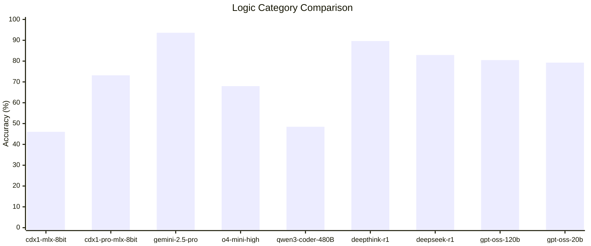
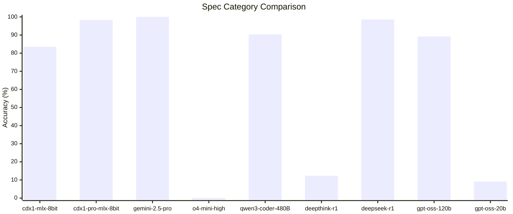

# Abstract

We present [cdx1](https://huggingface.co/collections/CycloneDX/cdx1-67a616a859ac0582df99700b) and [cdx1-pro](https://huggingface.co/collections/CycloneDX/cdx1-pro-688e15a3c3b593753ceefc05), a family of language models designed to emulate the expertise of a professional in DevOps, xBOM (Bill of Materials), and the CycloneDX specification. The base models, `unsloth/Qwen2.5-Coder-14B-Instruct` (for cdx1) and `unsloth/Qwen3-Coder-30B-A3B-Instruct` (for cdx1-pro), were fine-tuned on a specialized, high-quality [dataset](https://huggingface.co/CycloneDX/datasets). This dataset was constructed using a synthetic data generation strategy with a teacher model (Gemini 2.5 Pro). The primary objective was to align the fine-tuned models' capabilities with the teacher model's performance on xBOM and CycloneDX-related question-answering tasks.

## Approach to Data

### Data Curation and Generation

The models were trained on [cdx-docs](https://huggingface.co/datasets/CycloneDX/cdx-docs), a curated dataset comprising technical documentation, authoritative OWASP guides, and semantic interpretations derived from the CycloneDX Generator (cdxgen) source code. The dataset was augmented using a synthetic data generation technique. This process involved prompting a teacher model (Gemini 2.5 Pro) to generate question-answer pairs that encapsulate the nuances and semantics of the domain. The generated data was structured to facilitate effective learning by the target cdx1 models.

### Alignment with Inference

During the training phase, the dataset was iteratively refined to ensure the format and context of the training examples closely resembled the intended inference-time inputs. This alignment is critical for the models to learn the domain's complexity and respond accurately to real-world prompts.

## Benchmarking

The cdx1 models are optimized for xBOM use cases, including BOM summarization, component tagging, validation, and troubleshooting. To evaluate model performance, we developed a custom benchmark suite named [xBOMEval](https://github.com/CycloneDX/cdxgen/tree/master/contrib/xBOMEval).

### Categories

xBOMEval contains tests across the following categories:

- **Bias:** Assesses potential model bias towards CycloneDX or SPDX specifications through targeted questions.
- **Specification (Spec):** Measures factual recall and synthesis on topics such as CycloneDX, PURL, and SPDX.
- **Logic:** Evaluates problem-solving and reasoning capabilities with complex questions about specifications.
- **DevOps:** Assesses knowledge of platforms and tools like GitHub, Azure Pipelines, and package managers.
- **Linux:** Tests proficiency with Linux environments, including terminal and PowerShell commands.
- **Docker:** Measures understanding of Docker, Podman, and the OCI specification.

### Scoring

Model responses were scored using a combination of automated evaluation by a high-capability model (Gemini 2.5 Pro) and manual human review. To maintain benchmark integrity, the evaluation set was held out and not included in any model's training data. Detailed results and configurations are available in the `xBOMEval` directory of the [cdxgen repository](https://github.com/CycloneDX/cdxgen).

## Benchmark Results - August 2025

### Logic Category Comparison

The Logic category tests reasoning and problem-solving skills. The chart below compares the accuracy of nine models on these tasks.



**Summary of Results:**

- **Top Performer:** `gemini-2.5-pro` achieved the highest accuracy at 93.6%.
- **High Performers:** A group of models demonstrated strong reasoning, including `deepthink-r1` (89.6%), `deepseek-r1` (82.9%), and `gpt-oss-120b` (80.5%).
- **Specialized Model Performance:** `cdx1-pro` (30B parameters) performed competitively at 73.2%. The score for `cdx1` (14B parameters) was 46.0%, a result attributed primarily to context length limitations rather than a fundamental deficiency in logic.
- **Performance Tiers:** The results indicate distinct performance tiers, with a significant gap between the top-performing models (>80%) and others.

### Specification Category Comparison

The Spec category tests the recall of factual information from technical specifications.



**Summary of Results:**

- **Near-Perfect Recall:** `gemini-2.5-pro` (100%), `deepseek-r1` (98.6%), and `cdx1-pro` (98.3%) demonstrated exceptional performance.
- **Behavioral Failures:** Three models scored poorly due to operational issues rather than a lack of knowledge. `o4-mini-high` (0%) refused to answer, while `deepthink-r1` (12.4%) and `gpt-oss-20b` (9.1%) answered only a small fraction of questions.
- **`cdx1` Performance:** The smaller `cdx1` model scored 83.5%. Its performance was negatively affected by a systematic misunderstanding of certain technical terms, highlighting the challenge of ensuring factual accuracy in highly specialized domains.

### Other Categories

Performance in additional technical categories is summarized below.

| Category | cdx1-mlx-8bit | cdx1-pro-mlx-8bit |
| -------- | ------------- | ----------------- |
| DevOps   | 87.46%        | 96.1%             |
| Docker   | 89.08%        | 100%              |
| Linux    | 90.6%         | 95.8%             |

## Model Availability

The `cdx1` and `cdx1-pro` models are provided in multiple formats and quantization levels to facilitate deployment across diverse hardware environments. Models are available in the **MLX** format, optimized for local inference on Apple Silicon, and the **GGUF** format, which offers broad compatibility with CPUs and various GPUs. The selection of quantization levels allows users to balance performance with resource consumption, enabling effective operation even in environments with limited VRAM.

The table below details the available formats and their approximate resource requirements. All quantized models can be found on [Hugging Face](https://huggingface.co/CycloneDX/models).

| Model              | Format | Quantization | File Size (GiB) | Est. VRAM (GiB) | Notes                                      |
| :----------------- | :----- | :----------- | :-------------- | :-------------- | :----------------------------------------- |
| **cdx1 (14B)**     | MLX    | 4-bit        | ~8.1            | > 8             | For Apple Silicon with unified memory.     |
|                    | MLX    | 6-bit        | ~12             | > 12            | For Apple Silicon with unified memory.     |
|                    | MLX    | 8-bit        | ~14.2           | > 14            | Higher fidelity for Apple Silicon.         |
|                    | MLX    | 16-bit       | ~30             | > 30            | bfloat16 for fine-tuning.                  |
|                    | GGUF   | Q4_K_M       | 8.99            | ~10.5           | Recommended balance for quality/size.      |
|                    | GGUF   | Q8_0         | 15.7            | ~16.5           | Near-lossless quality.                     |
|                    | GGUF   | BF16         | 29.5            | ~30             | bfloat16 for fine-tuning.                  |
| **cdx1-pro (30B)** | MLX    | 4-bit        | ~17.5           | > 18            | For Apple Silicon with unified memory.     |
|                    | MLX    | 6-bit        | ~24.8           | > 25            | For Apple Silicon with unified memory.     |
|                    | MLX    | 8-bit        | ~32.4           | > 33            | Higher fidelity for Apple Silicon.         |
|                    | MLX    | 16-bit       | ~57             | > 57            | bfloat16 for fine-tuning.                  |
|                    | GGUF   | Q4_K_M       | 18.6            | ~20.0           | Recommended balance for quality/size.      |
|                    | GGUF   | IQ4_NL       | 17.6            | ~20.0           | Recommended balance for quality/size.      |
|                    | GGUF   | Q8_0         | 32.5            | ~33             | Near-lossless quality.                     |
|                    | GGUF   | Q2_K         | 11.3            | ~12             | Low quality. Use for speculative decoding. |
|                    | GGUF   | BF16         | 57              | ~60             | bfloat16 for fine-tuning.                  |

**Notes on Quantization and Formats:**

- **IQ4_NL (Importance-aware Quantization, Non-Linear):** A sophisticated 4-bit method that preserves important model weights with higher precision. It often provides superior performance compared to standard 4-bit quants at a similar file size and is a strong alternative to `Q4_K_M`.
- **K-Quants (Q2_K, Q4_K_M):** This family of quantization methods generally offers a better quality-to-size ratio than older \_0 or \_1 variants.
- **Q2_K:** An extremely small 2-bit quantization designed for environments with severe resource limitations. Users should anticipate a noticeable reduction in model accuracy and coherence in exchange for the minimal VRAM and storage footprint.
- **Q8_0:** A full 8-bit quantization that provides high fidelity at the cost of a larger file size. It is suitable for systems with ample VRAM.
- **VRAM Requirements:** The values provided are estimates for loading the model and processing a moderate context. Actual VRAM consumption can vary based on factors such as context length, batch size, and the specific inference software used.

## Safety and Bias

(To be determined)

## Weaknesses

(To be determined)

## Acknowledgments

(To be determined)

## Citation

Please cite the following resources if you use the datasets, models, or benchmark in your work.

### For the Dataset

```bibtex
@misc{cdx-docs,
  author = {OWASP CycloneDX Generator Team},
  title = {{cdx-docs: A Curated Dataset for SBOM and DevOps Tasks}},
  year = {2025},
  month = {February},
  howpublished = {\url{https://huggingface.co/datasets/CycloneDX/cdx-docs}}
}
```

### For the Models

```bibtex
@misc{cdx1_models,
  author = {OWASP CycloneDX Generator Team},
  title = {{cdx1 and cdx1-pro: Language Models for SBOM and DevOps}},
  year = {2025},
  month = {February},
  howpublished = {\url{https://huggingface.co/CycloneDX}}
}
```

### For the xBOMEval Benchmark

```bibtex
@misc{xBOMEval_v1,
  author = {OWASP CycloneDX Generator Team},
  title = {{xBOMEval: A Benchmark for Evaluating Language Models on SBOM Tasks}},
  year = {2025},
  month = {August},
  howpublished = {\url{https://github.com/CycloneDX/cdxgen}}
}
```

## Licenses

- **Datasets:** CC0-1.0
- **Models:** Apache-2.0
