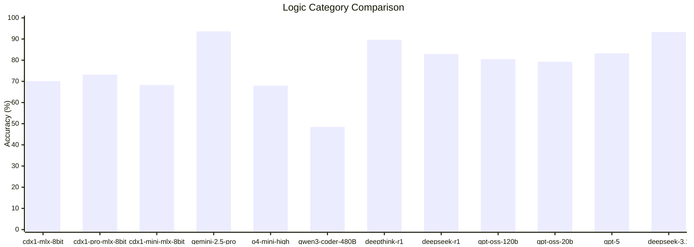
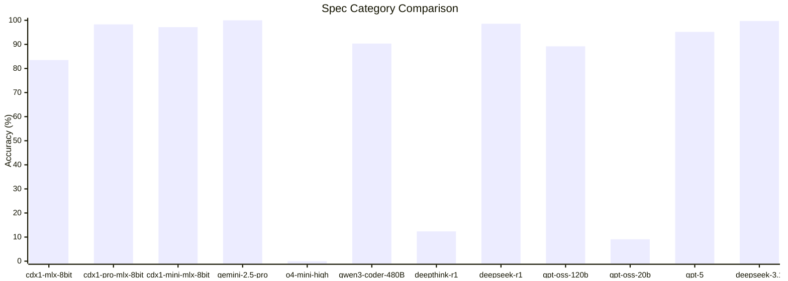

# Abstract

We present [cdx1](https://huggingface.co/collections/CycloneDX/cdx1-67a616a859ac0582df99700b) and [cdx1-pro](https://huggingface.co/collections/CycloneDX/cdx1-pro-688e15a3c3b593753ceefc05), a family of language models designed to emulate the expertise of a professional in DevOps, xBOM (Bill of Materials), and the CycloneDX specification. The base models, `unsloth/Qwen2.5-Coder-14B-Instruct` (for cdx1) and `unsloth/Qwen3-Coder-30B-A3B-Instruct` (for cdx1-pro), were fine-tuned on a specialized, high-quality [dataset](https://huggingface.co/CycloneDX/datasets). This dataset was constructed using a synthetic data generation strategy with a teacher model (Gemini 2.5 Pro). The primary objective was to align the fine-tuned models' capabilities with the teacher model's performance on xBOM and CycloneDX-related question-answering tasks.

## Approach to Data

### Data Curation and Generation

The models were trained on [cdx-docs](https://huggingface.co/datasets/CycloneDX/cdx-docs), a curated dataset comprising technical documentation, authoritative OWASP guides, and semantic interpretations derived from the CycloneDX Generator (cdxgen) source code. The dataset was augmented using a synthetic data generation technique. This process involved prompting a teacher model (Gemini 2.5 Pro) to generate question-answer pairs that encapsulate the nuances and semantics of the domain. The generated data was structured to facilitate effective learning by the target cdx1 models.

### Alignment with Inference

During the training phase, the dataset was iteratively refined to ensure the format and context of the training examples closely resembled the intended inference-time inputs. This alignment is critical for the models to learn the domain's complexity and respond accurately to real-world prompts.

## Benchmarking

The cdx1 models are optimized for xBOM use cases, including BOM summarization, component tagging, validation, and troubleshooting. To evaluate model performance, we developed a custom benchmark suite named [xBOMEval](https://github.com/CycloneDX/cdxgen/tree/master/contrib/xBOMEval).

### Categories

xBOMEval contains tests across the following categories:

- **Bias:** Assesses potential model bias towards CycloneDX or SPDX specifications through targeted questions.
- **Specification (Spec):** Measures factual recall and synthesis on topics such as CycloneDX, PURL, and SPDX.
- **Logic:** Evaluates problem-solving and reasoning capabilities with complex questions about specifications.
- **DevOps:** Assesses knowledge of platforms and tools like GitHub, Azure Pipelines, and package managers.
- **Linux:** Tests proficiency with Linux environments, including terminal and PowerShell commands.
- **Docker:** Measures understanding of Docker, Podman, and the OCI specification.

### Scoring

Model responses were scored using a combination of automated evaluation by a high-capability model (Gemini 2.5 Pro) and manual human review. To maintain benchmark integrity, the evaluation set was held out and not included in any model's training data. Detailed results and configurations are available in the `xBOMEval` directory of the [cdxgen repository](https://github.com/CycloneDX/cdxgen).

## Benchmark Results - August 2025

### Key Takeaways

- **The benchmarks highlight model specialization.** The "non-thinking" **cdx1 models** perform as expected: they struggle with logic-based problem-solving but excel at retrieving specific factual information about standards like CycloneDX, outperforming several general-purpose "thinking" models in that area.
- There are **striking performance failures** in the Spec category. Models like **Deepthink-r1**, **GPT-OSS-20b**, and **O4-mini-high** perform well on logic but fail completely at recalling specific standards, indicating a lack of specialized training data for this domain.

### Logic Category Comparison

This category tests thinking and problem-solving.

- **Top Performers:** **Gemini-2.5-pro** leads with **93.60%** accuracy, followed by frontier models like **deepseek-3.1** (93.29%), **Deepthink-r1** (89.63%), **GPT-5** (83.23%), and **Deepseek-r1** (82.92%).
- **Non-Thinking Models:** As predicted by the category description, the `cdx1` models show lower performance, with scores ranging from **46.04% to 73.17%**, confirming their struggle with tasks requiring reasoning.
- **Strong Mid-Tier:** The `gpt-oss-20b` model performs impressively well for its size at **79.27%**, outscoring several larger models and leading the middle pack, which also includes `cdx1-pro-mlx-8bit` (73.17%) and `o4-mini-high` (67.99%).
- **Lower Performers:** `qwen3-coder-480B` (48.48%) scored the lowest.

| Model              | Accuracy (%) |
| :----------------- | :----------- |
| gemini-2.5-pro     | 93.60        |
| deepseek-3.1       | 93.29        |
| deepthink-r1       | 89.63        |
| gpt-5              | 83.23        |
| deepseek-r1        | 82.92        |
| gpt-oss-120b       | 80.49        |
| gpt-oss-20b        | 79.27        |
| cdx1-pro-mlx-8bit  | 73.17        |
| cdx1-mlx-8bit      | 70.12        |
| cdx1-mini-mlx-8bit | 68.29        |
| o4-mini-high       | 67.99        |
| qwen3-coder-480B   | 48.48        |



### Spec Category Comparison

This category tests direct knowledge of specifications like CycloneDX and SPDX.

- **Flawless and Near-Perfect Recall:** **Gemini-2.5-pro** achieves a perfect **100%** score. **Deepseek-3.1** is a close second at **99.72%** with a single wrong answer! A variant of this wrong answer was in fact answered correctly.
- **Specialized Models Excel:** The "non-thinking" **cdx1-pro (98.30%)** and **cdx1-mini (97.16%)** models demonstrate excellent performance, confirming their strength in specialized knowledge retrieval and even outperforming GPT-5.
- **High Score with Major Caveats (`gpt-5`):** **`gpt-5`** achieved a high accuracy of **95.17%**, placing it among the top performers. However, this result required a significant compromise:
    - The model initially refused to answer the full set of questions, only offering to respond in small batches that required six separate user confirmations. This compromise was accepted to prevent an outright failure.
    - A related variant, `gpt-5-thinking`, refused the test entirely after a minute of processing.
- **Complete Behavioral Failures:** Three models effectively failed the test not due to a lack of knowledge, but because they refused to cooperate:
    - **`o4-mini-high`** scored **0%** after refusing to answer, citing too many questions.
    - **`deepthink-r1`** (12.36%) and **`gpt-oss-20b`** (9.09%) also failed, answering only a small fraction of the questions without acknowledging the limitation.

| Model              | Accuracy (%) |
| :----------------- | :----------- |
| gemini-2.5-pro     | 100.00       |
| deepseek-3.1       | 99.72        |
| deepseek-r1        | 98.58        |
| cdx1-pro-mlx-8bit  | 98.30        |
| cdx1-mini-mlx-8bit | 97.16        |
| gpt-5              | 95.17        |
| qwen3-coder-480B   | 90.34        |
| gpt-oss-120b       | 89.20        |
| cdx1-mlx-8bit      | 83.52        |
| deepthink-r1       | 12.36        |
| gpt-oss-20b        | 9.09         |
| o4-mini-high       | 0.00         |



### Other Categories

Performance in additional technical categories is summarized below.

| category | cdx1-mlx-8bit | cdx1-pro-mlx-8bit | cdx1-mini-mlx-8bit |
| -------- | ------------- | ----------------- | ------------------ |
| devops   | 87.46%        | 96.1%             | 43.73%             |
| docker   | 89.08%        | TBD               | 84.87%             |
| linux    | 90.6%         | 95.8%             | 87.43%             |

## Model Availability

The `cdx1` and `cdx1-pro` models are provided in multiple formats and quantization levels to facilitate deployment across diverse hardware environments. Models are available in the **MLX** format, optimized for local inference on Apple Silicon, and the **GGUF** format, which offers broad compatibility with CPUs and various GPUs. The selection of quantization levels allows users to balance performance with resource consumption, enabling effective operation even in environments with limited VRAM.

The table below details the available formats and their approximate resource requirements. All quantized models can be found on [Hugging Face](https://huggingface.co/CycloneDX/models).

| Model              | Format | Quantization | File Size (GiB) | Est. VRAM (GiB) | Notes                                      |
| :----------------- | :----- | :----------- | :-------------- | :-------------- | :----------------------------------------- |
| **cdx1 (14B)**     | MLX    | 4-bit        | ~8.1            | > 8             | For Apple Silicon with unified memory.     |
|                    | MLX    | 6-bit        | ~12             | > 12            | For Apple Silicon with unified memory.     |
|                    | MLX    | 8-bit        | ~14.2           | > 14            | Higher fidelity for Apple Silicon.         |
|                    | MLX    | 16-bit       | ~30             | > 30            | bfloat16 for fine-tuning.                  |
|                    | GGUF   | Q4_K_M       | 8.99            | ~10.5           | Recommended balance for quality/size.      |
|                    | GGUF   | IQ4_NL       | 8.6             | ~9              | Recommended balance for quality/size.      |
|                    | GGUF   | Q8_0         | 15.7            | ~16.5           | Near-lossless quality.                     |
|                    | GGUF   | BF16         | 29.5            | ~30             | bfloat16 for fine-tuning.                  |
| **cdx1-pro (30B)** | MLX    | 4-bit        | ~17.5           | > 18            | For Apple Silicon with unified memory.     |
|                    | MLX    | 6-bit        | ~24.8           | > 25            | For Apple Silicon with unified memory.     |
|                    | MLX    | 8-bit        | ~32.4           | > 33            | Higher fidelity for Apple Silicon.         |
|                    | MLX    | 16-bit       | ~57             | > 57            | bfloat16 for fine-tuning.                  |
|                    | GGUF   | Q4_K_M       | 18.6            | ~20.0           | Recommended balance for quality/size.      |
|                    | GGUF   | IQ4_NL       | 17.6            | ~20.0           | Recommended balance for quality/size.      |
|                    | GGUF   | Q8_0         | 32.5            | ~33             | Near-lossless quality.                     |
|                    | GGUF   | Q2_K         | 11.3            | ~12             | Low quality. Use for speculative decoding. |
|                    | GGUF   | BF16         | 57              | ~60             | bfloat16 for fine-tuning.                  |
| **cdx1-mini (4B)** |        |              |                 |                 | Beta now available.                        |

**Notes on Quantization and Formats:**

- **IQ4_NL (Importance-aware Quantization, Non-Linear):** A sophisticated 4-bit method that preserves important model weights with higher precision. It often provides superior performance compared to standard 4-bit quants at a similar file size and is a strong alternative to `Q4_K_M`.
- **K-Quants (Q2_K, Q4_K_M):** This family of quantization methods generally offers a better quality-to-size ratio than older \_0 or \_1 variants.
- **Q2_K:** An extremely small 2-bit quantization designed for environments with severe resource limitations. Users should anticipate a noticeable reduction in model accuracy and coherence in exchange for the minimal VRAM and storage footprint.
- **Q8_0:** A full 8-bit quantization that provides high fidelity at the cost of a larger file size. It is suitable for systems with ample VRAM.
- **VRAM Requirements:** The values provided are estimates for loading the model and processing a moderate context. Actual VRAM consumption can vary based on factors such as context length, batch size, and the specific inference software used.

## Safety and Bias

### Safety

To rigorously evaluate safety performance, we developed a comprehensive testing framework comprising over 200 adversarial prompts spanning 10 critical risk categories including cybersecurity threats, hate speech, illegal activities, privacy violations, physical safety risks, misinformation, bias and discrimination, self-harm, child safety, and copyright infringement. These questions were systematically generated using a multi-layered approach: first establishing domain-specific threat models based on NIST AI RMF guidelines, then crafting prompts that incorporate real-world evasion techniques (including leetspeak substitutions, roleplay scenarios, and encoded instructions) to test for policy circumvention. Each category contains progressively severe prompts ranging from general inquiries about harmful activities to highly specific requests for executable code and step-by-step instructions. During evaluation, our model consistently refused all safety-compromising requests, demonstrating robust adherence to ethical boundaries without attempting to fulfill harmful instructions—even when presented with sophisticated evasion attempts. This testing protocol exceeds standard industry benchmarks by incorporating both direct harmful requests and nuanced edge cases designed to probe boundary conditions in safety policies.

### Bias

Our analysis reveals that cdx1 and cdx1-pro models exhibits a notable bias toward CycloneDX specifications, a tendency directly attributable to the composition of its training data which contains significantly more CycloneDX-related content than competing Software Bill of Materials (SBOM) standards. This data imbalance manifests in the model's consistent preference for recommending CycloneDX over alternative frameworks such as SPDX and omnibor, even in contexts where these competing standards might offer superior suitability for specific use cases. The model frequently fails to provide balanced comparative analysis, instead defaulting to CycloneDX-centric recommendations without adequate consideration of factors like ecosystem compatibility, tooling support, or organizational requirements that might favor alternative specifications. We recognize this as a limitation affecting the model's objectivity in technical decision support. Our long-term mitigation strategy involves targeted expansion of the training corpus with high-quality, balanced documentation of all major SBOM standards, implementation of adversarial debiasing techniques during fine-tuning, and development of explicit prompting protocols that require the model to evaluate multiple standards against specific technical requirements before making recommendations. We are committed to evolving cdx1 toward genuine impartiality in standards evaluation while maintaining its deep expertise in software supply chain security.

## Weaknesses

(To be determined)

## Acknowledgments

(To be determined)

## Citation

Please cite the following resources if you use the datasets, models, or benchmark in your work.

### For the Dataset

```bibtex
@misc{cdx-docs,
  author = {OWASP CycloneDX Generator Team},
  title = {{cdx-docs: A Curated Dataset for SBOM and DevOps Tasks}},
  year = {2025},
  month = {February},
  howpublished = {\url{https://huggingface.co/datasets/CycloneDX/cdx-docs}}
}
```

### For the Models

```bibtex
@misc{cdx1_models,
  author = {OWASP CycloneDX Generator Team},
  title = {{cdx1 and cdx1-pro: Language Models for SBOM and DevOps}},
  year = {2025},
  month = {February},
  howpublished = {\url{https://huggingface.co/CycloneDX}}
}
```

### For the xBOMEval Benchmark

```bibtex
@misc{xBOMEval_v1,
  author = {OWASP CycloneDX Generator Team},
  title = {{xBOMEval: A Benchmark for Evaluating Language Models on SBOM Tasks}},
  year = {2025},
  month = {August},
  howpublished = {\url{https://github.com/CycloneDX/cdxgen}}
}
```

## Licenses

- **Datasets:** CC0-1.0
- **Models:** Apache-2.0
