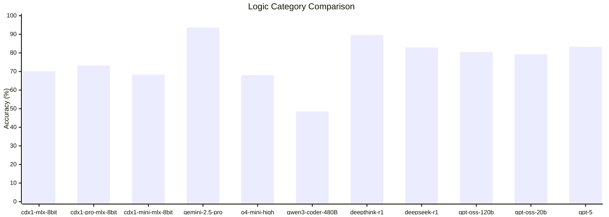
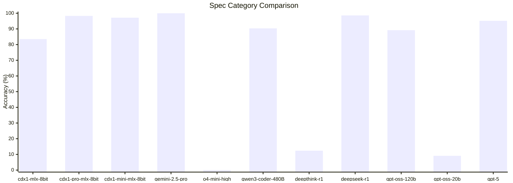

# Introduction

This directory captures the raw test results from various models over time.

## Aug 2025

### Key Takeaways

*   **The benchmarks highlight model specialization.** The "non-thinking" **cdx1 models** perform as expected: they struggle with logic-based problem-solving but excel at retrieving specific factual information about standards like CycloneDX, outperforming several general-purpose "thinking" models in that area.
*   There are **striking performance failures** in the Spec category. Models like **Deepthink-r1**, **GPT-OSS-20b**, and **O4-mini-high** perform well on logic but fail completely at recalling specific standards, indicating a lack of specialized training data for this domain.

### Logic Category Comparison

This category tests thinking and problem-solving.

*   **Top Performers:** **Gemini-2.5-pro** leads with **93.60%** accuracy, followed by other strong "thinking" models like **Deepthink-r1** (89.63%), **GPT-5** (83.23%), and **Deepseek-r1** (82.92%).
*   **Non-Thinking Models:** As predicted by the category description, the `cdx1` models show lower performance, with scores ranging from **46.04% to 73.17%**, confirming their struggle with tasks requiring reasoning.
*   **Strong Mid-Tier:** The `gpt-oss-20b` model performs impressively well for its size at **79.27%**, outscoring several larger models and leading the middle pack, which also includes `cdx1-pro-mlx-8bit` (73.17%) and `o4-mini-high` (67.99%).
*   **Lower Performers:** `qwen3-coder-480B` (48.48%) scored the lowest.

| Model              | Accuracy (%) |
| :----------------- |:-------------|
| gemini-2.5-pro     | 93.60        |
| deepthink-r1       | 89.63        |
| gpt-5              | 83.23        |
| deepseek-r1        | 82.92        |
| gpt-oss-120b       | 80.49        |
| gpt-oss-20b        | 79.27        |
| cdx1-pro-mlx-8bit  | 73.17        |
| cdx1-mlx-8bit      | 70.12        |
| cdx1-mini-mlx-8bit | 68.29        |
| o4-mini-high       | 67.99        |
| qwen3-coder-480B   | 48.48        |

### Spec Category Comparison

This category tests direct knowledge of specifications like CycloneDX and SPDX.

*   **Flawless and Near-Perfect Recall:** **Gemini-2.5-pro** achieves a perfect **100%** score. **Deepseek-r1** is a close second at **98.58%**.
*   **Specialized Models Excel:** The "non-thinking" **cdx1-pro (98.30%)** and **cdx1-mini (97.16%)** models demonstrate excellent performance, confirming their strength in specialized knowledge retrieval and even outperforming GPT-5.
*   **High Score with Major Caveats (`gpt-5`):** **`gpt-5`** achieved a high accuracy of **95.17%**, placing it among the top performers. However, this result required a significant compromise:
    - The model initially refused to answer the full set of questions, only offering to respond in small batches that required six separate user confirmations. This compromise was accepted to prevent an outright failure.
    - A related variant, `gpt-5-thinking`, refused the test entirely after a minute of processing.
*  **Complete Behavioral Failures:** Three models effectively failed the test not due to a lack of knowledge, but because they refused to cooperate:
    - **`o4-mini-high`** scored **0%** after refusing to answer, citing too many questions.
    - **`deepthink-r1`** (12.36%) and **`gpt-oss-20b`** (9.09%) also failed, answering only a small fraction of the questions without acknowledging the limitation.

| Model              | Accuracy (%) |
|:-------------------|:-------------|
| gemini-2.5-pro     | 100.00       |
| deepseek-r1        | 98.58        |
| cdx1-pro-mlx-8bit  | 98.30        |
| cdx1-mini-mlx-8bit | 97.16        |
| gpt-5              | 95.17        |
| qwen3-coder-480B   | 90.34        |
| gpt-oss-120b       | 89.20        |
| cdx1-mlx-8bit      | 83.52        |
| deepthink-r1       | 12.36        |
| gpt-oss-20b        | 9.09         |
| o4-mini-high       | 0.00         |

### Other categories

| category | cdx1-mlx-8bit  | cdx1-pro-mlx-8bit  | cdx1-mini-mlx-8bit |
| -------- |----------------|--------------------|--------------------|
| devops   | 87.46%         | 96.1%              | 43.73%             |
| docker   | 89.08%         | TBD                | 84.87%             |
| linux    | 90.6%          | 95.8%              | 87.43%             |
