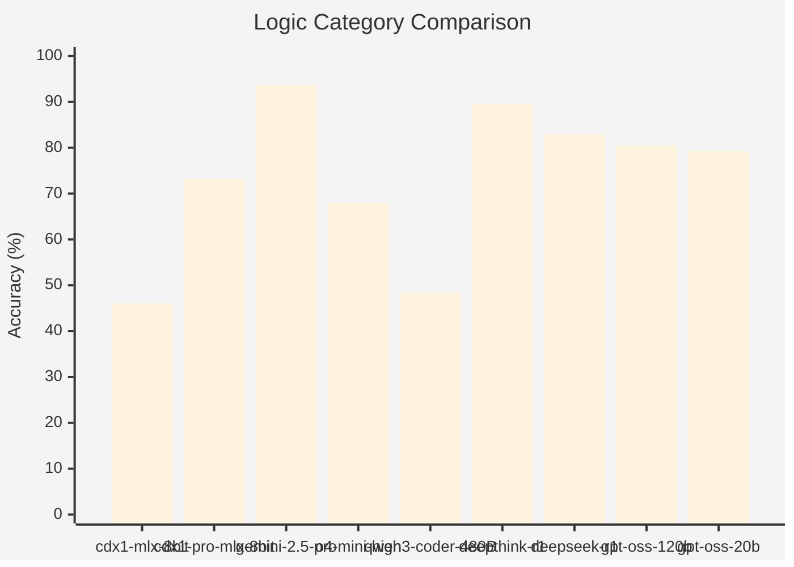
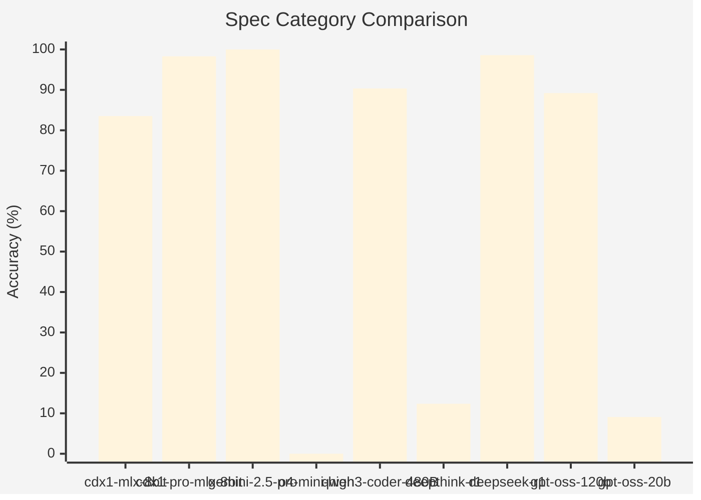

# Introduction

This directory captures the raw test results from various models over time.

## 5 Aug 2025

### Logic Category Comparison

### Spec Category Comparison

### Other categories

| category | cdx1-mlx-8bit | cdx1-pro-mlx-8bit |
|----------|---------------|-------------------|
| devops | 87.46% | 96.1% |
| docker | 89.08% | 100% |
| linux | 90.6% | 95.8% |
