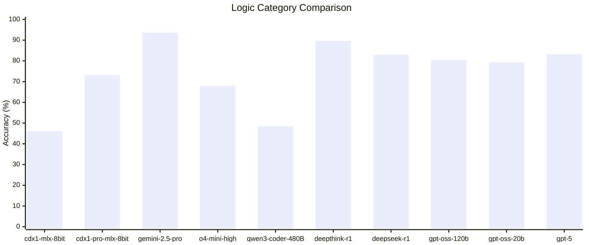
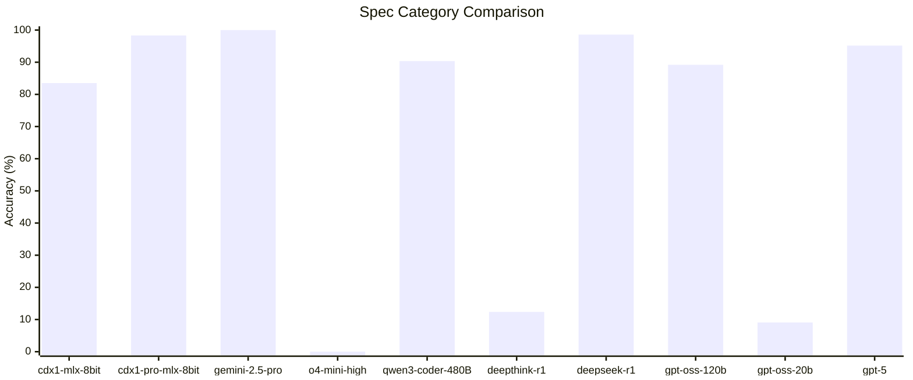

# Introduction

This directory captures the raw test results from various models over time.

## 5 Aug 2025

### Logic Category Comparison

| Model               | Accuracy (%) |
| :------------------ | :----------- |
| `gemini-2.5-pro`    | 93.60        |
| `deepthink-r1`      | 89.63        |
| `gpt-5`             | 83.23        |
| `deepseek-r1`       | 82.92        |
| `gpt-oss-120b`      | 80.49        |
| `gpt-oss-20b`       | 79.27        |
| `cdx1-pro-mlx-8bit` | 73.17        |
| `o4-mini-high`      | 67.99        |
| `qwen3-coder-480B`  | 48.48        |
| `cdx1-mlx-8bit`     | 46.04        |

This bar chart compares the accuracy of **ten** different AI models on a logic benchmark designed to assess reasoning and problem-solving skills. The results highlight a clear hierarchy of performance, with the newly added `gpt-5` debuting as a top-tier model.

**Key Findings from the Chart:**

- **Dominant Leader:** `gemini-2.5-pro` is the undisputed leader, achieving the highest accuracy of **93.6%**, placing it in a class of its own.
- **Top-Tier Competitors:** A strong group of models follows, led by `deepthink-r1` at **89.63%**. The newly introduced **`gpt-5`** makes a powerful debut, securing the third-place spot with **83.23%** accuracy. It slightly outperforms `deepseek-r1` (82.92%) and `gpt-oss-120b` (80.49%).
- **Strong Mid-Tier:** The `gpt-oss-20b` model performs impressively well for its size at **79.27%**, outscoring several larger models and leading the middle pack, which also includes `cdx1-pro-mlx-8bit` (73.17%) and `o4-mini-high` (67.99%).
- **Lower Performers:** `qwen3-coder-480B` (48.48%) and `cdx1-mlx-8bit` (46.04%) score the lowest. It is noted that the score for `cdx1-mlx-8bit` is artificially low due to context length limitations, which caused it to miss questions.
- **Efficiency and Performance:** The results from the `gpt-oss` models, particularly the 20B variant, demonstrate that highly optimized, smaller models can be very competitive on logic tasks.

### Performance Tiers

The models can be grouped into four clear performance tiers:

- **Elite Tier (>90%):**
  - `gemini-2.5-pro` (93.6%)
- **High-Performing Tier (80%-90%):**
  - `deepthink-r1` (89.63%)
  - `gpt-5` (83.23%)
  - `deepseek-r1` (82.92%)
  - `gpt-oss-120b` (80.49%)
- **Mid-Tier (65%-80%):**
  - `gpt-oss-20b` (79.27%)
  - `cdx1-pro-mlx-8bit` (73.17%)
  - `o4-mini-high` (67.99%)
- **Lower Tier (<50%):**
  - `qwen3-coder-480B` (48.48%)
  - `cdx1-mlx-8bit` (46.04%)

### Spec Category Comparison

| Model               | Accuracy (%) |
| :------------------ | :----------- |
| `gemini-2.5-pro`    | 100.00       |
| `deepseek-r1`       | 98.58        |
| `cdx1-pro-mlx-8bit` | 98.30        |
| `gpt-5`             | 95.17        |
| `qwen3-coder-480B`  | 90.34        |
| `gpt-oss-120b`      | 89.20        |
| `cdx1-mlx-8bit`     | 83.52        |
| `deepthink-r1`      | 12.36        |
| `gpt-oss-20b`       | 9.09         |
| `o4-mini-high`      | 0.00         |

This bar chart evaluates **ten** AI models on the "Spec Category," a test of factual recall on 352 technical specification questions. The results starkly illustrate that a model's reliability and cooperative behavior are as crucial as its underlying knowledge. Several models, including the newly added `gpt-5`, achieved high scores only after overcoming significant behavioral hurdles.

**Key Findings from the Chart:**

- **Elite Factual Recall:** A top tier of models demonstrated near-perfect knowledge retrieval. **`gemini-2.5-pro`** led with a perfect **100%** score and superior answer depth. It was closely followed by **`deepseek-r1`** (98.58%) and **`cdx1-pro-mlx-8bit`** (98.3%).

- **High Score with Major Caveats (`gpt-5`):** The newly added **`gpt-5`** achieved a high accuracy of **95.17%**, placing it among the top performers. However, this result required a significant compromise:
  - The model initially refused to answer the full set of questions, only offering to respond in small batches that required six separate user confirmations. This compromise was accepted to prevent an outright failure.
  - A related variant, `gpt-5-thinking`, refused the test entirely after a minute of processing.

- **Complete Behavioral Failures:** Three models effectively failed the test not due to a lack of knowledge, but because they refused to cooperate:
  - **`o4-mini-high`** scored **0%** after refusing to answer, citing too many questions.
  - **`deepthink-r1`** (12.36%) and **`gpt-oss-20b`** (9.09%) also failed, answering only a small fraction of the questions without acknowledging the limitation.

- **Strong Mid-Tier Performers:** `qwen3-coder-480B` (90.34%) and `gpt-oss-120b` (89.2%) both demonstrated strong and reliable factual recall without the behavioral issues seen elsewhere.

- **Impact of Scale and Systematic Errors:** The contrast between the two `cdx1` models is revealing. The larger `cdx1-pro-mlx-8bit` (98.3%) performed exceptionally well, while the smaller `cdx1-mlx-8bit` (83.52%) was hampered by a single systematic error (misunderstanding "CBOM"), which cascaded into multiple wrong answers.

### Summary of Key Themes

1.  **Reliability is Paramount:** This test's most important finding is that knowledge is useless if a model is unwilling or unable to share it. The failures of `o4-mini-high`, `deepthink-r1`, `gpt-oss-20b`, and the behavioral friction from `gpt-5` highlight this critical dimension.
2.  **Scores Don't Tell the Whole Story:** The 95.17% score for `gpt-5` obscures the significant user intervention required to obtain it. Similarly, the near-identical scores of `cdx1-pro` and `gemini-2.5-pro` don't capture Gemini's superior answer quality.
3.  **Scale Can Overcome Flaws:** The dramatic performance leap from the 14B to the 30B `cdx1` model suggests that increased scale can help correct for specific knowledge gaps and improve overall accuracy.

### Other categories

| category | cdx1-mlx-8bit | cdx1-pro-mlx-8bit |
| -------- | ------------- | ----------------- |
| devops   | 87.46%        | 96.1%             |
| docker   | 89.08%        | 100%              |
| linux    | 90.6%         | 95.8%             |
