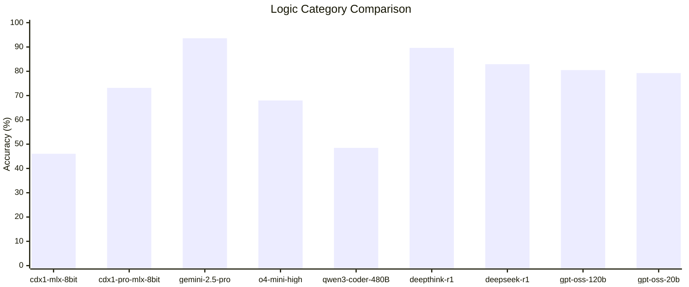
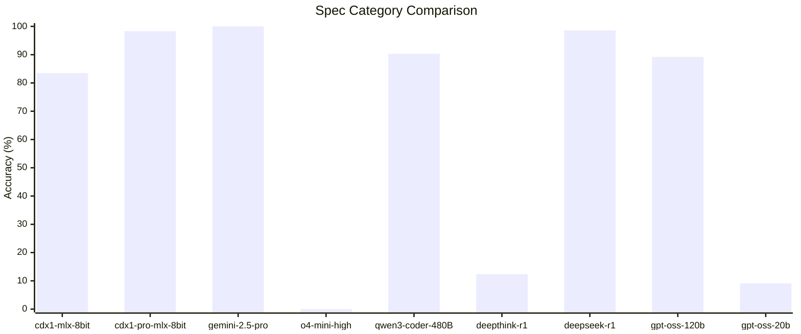

# Introduction

This directory captures the raw test results from various models over time.

## 5 Aug 2025

### Summary of Logic Category Comparison

This bar chart compares the accuracy of **nine** different AI models on logic tests, which are designed to assess thinking and problem-solving abilities. Non-thinking models are expected to struggle with these tasks.

**Key Observations from the Chart:**

- **Top Performers:** The standout model remains **`gemini-2.5-pro`**, achieving the highest accuracy at **93.6%**. It is followed by a group of strong performers, including **`deepthink-r1`** (89.63%), **`deepseek-r1`** (82.92%), and the newly added **`gpt-oss-120b`** (**80.49%**), which all demonstrate advanced logical reasoning capabilities.

- **Strong Debut from gpt-oss Models:** The new additions, **`gpt-oss-120b`** (80.49%) and **`gpt-oss-20b`** (79.27%), both show very strong results. `gpt-oss-120b` joins the top tier of performers, while `gpt-oss-20b` scores impressively high, outperforming several other models.

- **Strong "Non-Thinking" Model Performance:** Despite being a non-thinking model, the 30B parameter **`cdx1-pro-mlx-8bit`** shows a strong performance with an accuracy of **73.17%**. This score is competitive, though it is now surpassed by the new `gpt-oss-20b`.

- **Context-Limited Model:** The 14B parameter **`cdx1-mlx-8bit`** scored the lowest at **46.04%**. As noted, this score is artificially low due to the model missing many questions, likely because of context length limitations, rather than solely a lack of logical ability.

- **Performance Tiers:** The models can be grouped into clear performance tiers:
  - **Top Tier (>80%):** `gemini-2.5-pro`, `deepthink-r1`, `deepseek-r1`, `gpt-oss-120b`.
  - **Mid Tier (65%-80%):** `gpt-oss-20b`, `cdx1-pro-mlx-8bit`, `o4-mini-high` (67.99%).
  - **Lower Tier (<50%):** `qwen3-coder-480B` (48.48%), `cdx1-mlx-8bit` (46.04%).

- **Inferred Points:**
  - There is a significant performance gap between the top-tier models and the rest, highlighting a clear distinction in advanced problem-solving skills.
  - The strong performance of `cdx1-pro-mlx-8bit` suggests that even non-thinking models, when scaled up (from 14B to 30B parameters in this case), can achieve respectable accuracy on logic tasks.
  - The impressive results from both `gpt-oss` models, particularly the `20b` variant, suggest that high performance on logic tasks is achievable without necessarily being the absolute largest model in the comparison.

### Summary of Spec Category Comparison

This bar chart evaluates the performance of **nine** AI models on the "Spec Category," which consists of 352 direct questions about technical specifications like CycloneDX, PURL, and SPDX. This test primarily measures a model's ability to recollect and synthesize factual information, a task where most models are expected to perform well.

**Key Observations from the Chart:**

- **Top-Tier Performance:** Three models achieved near-perfect or perfect scores, demonstrating exceptional factual recall:
  - **`gemini-2.5-pro`** achieved a perfect score of **100%**. The provided context notes its answers also had superior depth.
  - **`deepseek-r1`** was the top performer at **98.58%**.
  - **`cdx1-pro-mlx-8bit`** also scored an impressive **98.3%**, showing strong capability for a non-thinking, quantized model.

- **Strong Performers:** Just below the top tier, **`qwen3-coder-480B`** (90.34%) and the newly added **`gpt-oss-120b`** (**89.2%**) also delivered very strong results, demonstrating robust factual recall.

- **Complete Failures Due to Behavior:** **Three** models failed the test not due to a lack of knowledge, but due to their operational behavior:
  - **`o4-mini-high`** scored **0%** because it refused to answer the questions, citing that there were too many.
  - **`deepthink-r1`** scored a very low **12.36%** because it only answered a small fraction of the questions and failed to acknowledge this limitation in its response.
  - **`gpt-oss-20b`** scored just **9.09%**. As noted, this low score is also a behavioral failure, as the model **only answered 32 questions**, likely due to context length limits or other usage restrictions.

- **Performance of the `cdx1` Models:**
  - The 30B **`cdx1-pro-mlx-8bit`** model performed exceptionally well (98.3%).
  - The smaller 14B **`cdx1-mlx-8bit`** model achieved a respectable score of **83.52%**. However, its score was significantly impacted by a systematic error: it incorrectly assumed the "C" in "CBOM" stood for "cloud-native," leading to a cascade of wrong answers. It also answered all questions related to the "provides" field incorrectly.
  - It is noted that both `cdx1` models received several "grace marks," indicating their raw scores might have been lower and highlighting known limitations in the evaluation dataset.

- **Inferred Key Points:**
  - **Reliability Over Knowledge:** This test highlights that model reliability and compliance are as critical as factual knowledge. The failures of `o4-mini-high`, `deepthink-r1`, and now **`gpt-oss-20b`** were behavioral, not informational.
  - **Impact of Model Scale:** The significant performance jump from `cdx1-mlx-8bit` (14B, 83.52%) to `cdx1-pro-mlx-8bit` (30B, 98.3%) suggests that larger model scale can help overcome specific factual errors and improve overall accuracy.
  - **Accuracy vs. Depth:** While `cdx1-pro` nearly matched `gemini-2.5-pro` in accuracy, the note about Gemini's superior answer depth shows that quantitative scores alone don't capture the full picture of a model's quality.
  - **Systematic Errors:** The performance of `cdx1-mlx-8bit` demonstrates how a single, fundamental misunderstanding can disproportionately lower a model's score in a specialized knowledge domain.

### Other categories

| category | cdx1-mlx-8bit | cdx1-pro-mlx-8bit |
| -------- | ------------- | ----------------- |
| devops   | 87.46%        | 96.1%             |
| docker   | 89.08%        | 100%              |
| linux    | 90.6%         | 95.8%             |
