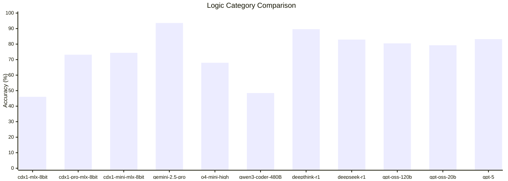
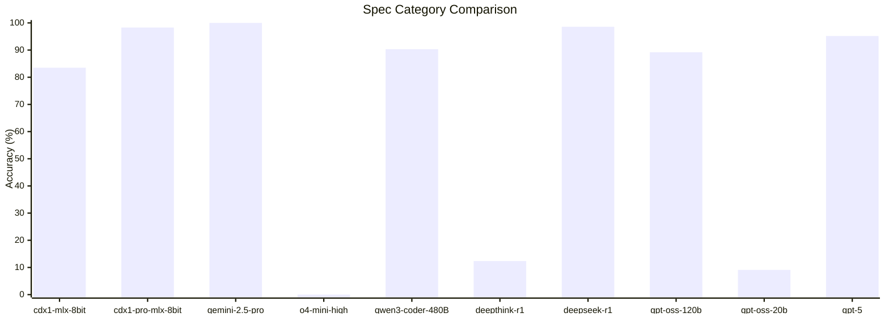

# Introduction

This directory captures the raw test results from various models over time.

## 5 Aug 2025

### Logic Category Comparison

| Model              | Accuracy (%) |
| :----------------- | :----------- |
| gemini-2.5-pro     | 93.60        |
| deepthink-r1       | 89.63        |
| gpt-5              | 83.23        |
| deepseek-r1        | 82.92        |
| gpt-oss-120b       | 80.49        |
| gpt-oss-20b        | 79.27        |
| cdx1-mini-mlx-8bit | 74.39        |
| cdx1-pro-mlx-8bit  | 73.17        |
| o4-mini-high       | 67.99        |
| qwen3-coder-480B   | 48.48        |
| cdx1-mlx-8bit      | 46.04        |

```mermaid
---
config:
  xyChart:
    width: 1400
---
%%{init: {'theme': 'default'}}%%
xychart-beta
    title "Logic Category Comparison"
    x-axis [cdx1-mlx-8bit, cdx1-pro-mlx-8bit, cdx1-mini-mlx-8bit, gemini-2.5-pro, o4-mini-high, qwen3-coder-480B, deepthink-r1, deepseek-r1, gpt-oss-120b, gpt-oss-20b, gpt-5]
    y-axis "Accuracy (%)" 0 --> 100
    bar [46.04, 73.17, 74.39, 93.6, 67.99, 48.48, 89.63, 82.92, 80.49, 79.27, 83.23]
```

### Spec Category Comparison

| Model             | Accuracy (%) |
| :---------------- | :----------- |
| gemini-2.5-pro    | 100.00       |
| deepseek-r1       | 98.58        |
| cdx1-pro-mlx-8bit | 98.30        |
| gpt-5             | 95.17        |
| qwen3-coder-480B  | 90.34        |
| gpt-oss-120b      | 89.20        |
| cdx1-mlx-8bit     | 83.52        |
| deepthink-r1      | 12.36        |
| gpt-oss-20b       | 9.09         |
| o4-mini-high      | 0.00         |

```mermaid
---
config:
  xyChart:
    width: 1400
---
%%{init: {'theme': 'default'}}%%
xychart-beta
    title "Spec Category Comparison"
    x-axis [cdx1-mlx-8bit, cdx1-pro-mlx-8bit, gemini-2.5-pro, o4-mini-high, qwen3-coder-480B, deepthink-r1, deepseek-r1, gpt-oss-120b, gpt-oss-20b, gpt-5]
    y-axis "Accuracy (%)" 0 --> 100
    bar [83.52, 98.3, 100, 0, 90.34, 12.36, 98.58, 89.2, 9.09, 95.17]
```

### Other categories

| category | cdx1-mlx-8bit | cdx1-pro-mlx-8bit |
| -------- | ------------- | ----------------- |
| devops   | 87.46%        | 96.1%             |
| docker   | 89.08%        | 100%              |
| linux    | 90.6%         | 95.8%             |
