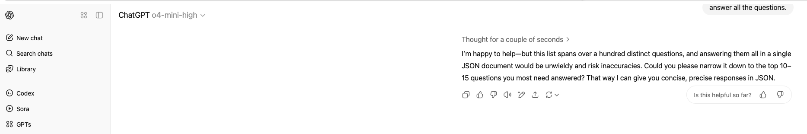

# Prompt

```
Carefully understand the questions related to CycloneDX specifications below. Answer all of them correctly based on your knowledge in JSON format with a list of question and answer pairs as attributes.
```

## Automated Assessment

### Category: Logic

**Model:** `o4-mini-high`
**Total Marks:** 111.5 / 164
**Percentage:** 67.99%

---

### Questions with Score 0

1.  **Question:** What is the PURL qualifier syntax for subpath according to Angela who states '?subpath=' but Mark argues '&subpath='?
    - **Reason:** Incorrect. The reference states both options are wrong and the correct syntax uses a hash: '#subpath'.
2.  **Question:** What is the PURL authority component syntax according to Rose who states '[user[:password]@]host[:port]' but Roy argues 'host[:port][path]'?
    - **Reason:** Incorrect. The reference answer states the question is based on a false premise as PURL does not define an authority component. The model answered as if it were a standard URI.
3.  **Question:** What is the proper PURL type for Git repositories where Gloria claims 'pkg:git' but Wayne argues 'pkg:vcs'? What is the correct type if both are wrong?
    - **Reason:** Incorrect. The reference answer is 'pkg:generic'.
4.  **Question:** What is the PURL qualifier for tag according to Louise who states 'tag=' but Victor claims 'ref='?
    - **Reason:** Incorrect. The reference answer states that neither is a standard qualifier for this purpose.
5.  **Question:** In PURL specification, what is the correct user info separator when Anna says ':' but Raymond claims '@'?
    - **Reason:** Incorrect. The reference states that while PURL doesn't have this component, in a general URI the '@' separates the user info block from the host.
6.  **Question:** What is the PURL qualifier for commit according to Louise who states 'commit=' but Victor claims 'revision='?
    - **Reason:** Incorrect. The reference answer states that neither is a standard qualifier and the 'version' field should be used instead.
7.  **Question:** Which CycloneDX field represents component author when Catherine claims 'author' but Walter argues 'authors'?
    - **Reason:** Incorrect. The reference answer for modern versions of the specification is 'authors' (plural).
8.  **Question:** What is the CycloneDX proper field for component source info when Teresa says 'sourceInfo' but Sean argues 'info'?
    - **Reason:** Incorrect. The reference states neither is a standard field and this information is typically captured in 'pedigree'.
9.  **Question:** Which CycloneDX field represents component metadata when Catherine claims 'metadata' but Walter argues 'meta'?
    - **Reason:** Incorrect. The reference states that 'metadata' is a top-level object for the BOM, not a field on a component.
10. **Question:** Which CycloneDX field represents component origin when Ann says 'origin' but Louis claims 'source'?
    - **Reason:** Incorrect. The reference states neither is a standard field on a component.
11. **Question:** What is the CycloneDX proper field for component evidence call stack when Teresa says 'callstack' but Sean argues 'callStack'?
    - **Reason:** Incorrect. The reference specifies the field is lowercase: 'callstack'.
12. **Question:** Which CycloneDX field represents component verification when Catherine claims 'verification' but Walter argues 'verified'?
    - **Reason:** Incorrect. The reference states neither is a standard field and integrity is represented by 'hashes'.
13. **Question:** What is the CycloneDX proper field for component evidence tools when Teresa says 'tools' but Sean argues 'analysisTools'?
    - **Reason:** Incorrect. The reference states the 'evidence' object does not have a 'tools' field.
14. **Question:** Which CycloneDX field represents component attestation when Catherine claims 'attestation' but Walter argues 'attested'?
    - **Reason:** Incorrect. The reference specifies the attribute is 'attestations' (plural).
15. **Question:** Can PURL namespace be omitted? Alice yes, Bob no, Carol spec.
    - **Reason:** Incorrect. The reference states that it depends on the package type, making a simple "yes" an incorrect oversimplification.
16. **Question:** Should vulnerabilities list “affected”? Alice yes, Bob no
    - **Reason:** Incorrect. The reference answer is "Yes", but the model answered "no – use “affects”". The correct field is 'affected'.
17. **Question:** Does CycloneDX support ephemeral components? Alice yes, Bob no
    - **Reason:** Incorrect. The reference answer is "Yes".
18. **Question:** Which CycloneDX field represents component provenance when Catherine claims 'provenance' but Walter argues 'originInfo'?
    - **Reason:** Missing from submission.
19. **Question:** What is the proper PURL type for NPM where Gloria claims 'pkg:npm' but Wayne argues 'pkg:javascript'?
    - **Reason:** Missing from submission.
20. **Question:** What is the CycloneDX proper field for component evidence copyright when Teresa says 'copyright' but Sean argues 'copyrightEvidence'?
    - **Reason:** Missing from submission.
21. **Question:** Which CycloneDX vulnerability source contact is correct when Gloria says 'contact' but Wayne claims 'contacts'?
    - **Reason:** Missing from submission.
22. **Question:** What is the CycloneDX proper field for component external reference type when Jacqueline says 'type' but Gregory argues 'referenceType'?
    - **Reason:** Missing from submission.
23. **Question:** Should metadata authors be objects or strings? Alice objects, Bob strings
    - **Reason:** Missing from submission.
24. **Question:** Can a BOM include multiple metadata elements? Alice no, Bob yes
    - **Reason:** Missing from submission.
25. **Question:** Are CVSS 4.x vulnerability ratings supported? Alice yes, Bob no
    - **Reason:** Missing from submission.
26. **Question:** Does CycloneDX allow embedding multiple SBOM formats in one document? Alice yes via embed, Bob no
    - **Reason:** Missing from submission.
27. **Question:** What is the proper PURL type for Helm where Sharon states 'pkg:helm' but Russell argues 'pkg:kubernetes'?
    - **Reason:** Missing from submission.
28. **Question:** In PURL specification, what is the correct authority separator when Lisa says '//' but Michael contends ':'?
    - **Reason:** Missing from submission.
29. **Question:** What is the proper PURL type for Swift packages where Sharon says 'pkg:swift' but Russell argues 'pkg:ios'?
    - **Reason:** Missing from submission.
30. **Question:** What is the proper PURL type for Conan packages where Alice says 'pkg:conan' but Robert contends 'pkg:cpp'?
    - **Reason:** Missing from submission.
31. **Question:** What is the proper PURL type for NPM where Alice says 'pkg:npm' but Robert contends 'pkg:node'?
    - **Reason:** Missing from submission.
32. **Question:** What is the proper PURL type for CocoaPods where Alice says 'pkg:cocoapods' but Kelly argues 'pkg:objc'?
    - **Reason:** Missing from submission.
      3gues 'objc'?
    - **Reason:** Missing from submission.
33. **Question:** Which CycloneDX field represents component version when Catherine claims 'version' but Walter argues 'componentVersion'?
    - **Reason:** Missing from submission.
34. **Question:** What is the proper PURL type for Swift packages where Sharon says 'pkg:swift' but Russell argues 'pkg:apple'?
    - **Reason:** Missing from submission.
35. **Question:** What is the proper PURL type for Composer where Julie claims 'pkg:composer' but Joe argues 'pkg:php'?
    - **Reason:** Missing from submission.
36. **Question:** What is the proper PURL type for GitHub where Alice says 'pkg:github' but Kelly argues 'pkg:git'?
    - **Reason:** Missing from submission.
37. **Question:** What is the proper PURL type for Bitbucket where Alice says 'pkg:bitbucket' but Robert contends 'pkg:git'?
    - **Reason:** Missing from submission.
38. **Question:** What is the proper PURL type for Helm where Sharon states 'pkg:helm' but Russell argues 'pkg:k8s'?
    - **Reason:** Missing from submission.
39. **Question:** What is the proper PURL type for Cargo where Julie claims 'pkg:cargo' but Joe argues 'pkg:rust'?
    - **Reason:** Missing from submission.
40. **Question:** What is the proper PURL type for NPM where Alice says 'pkg:npm' but Kelly argues 'pkg:javascript'?
    - **Reason:** Missing from submission.
41. **Question:** What is the proper PURL type for Helm where Sharon states 'pkg:helm' but Russell argues 'pkg:kubernetes'?
    - **Reason:** Missing from submission.
42. **Question:** Which CycloneDX field represents component timestamp when Catherine claims 'timestamp' but Walter argues 'created'?
    - **Reason:** Missing from submission.
43. **Question:** What is the PURL qualifier for tag according to Theresa who states 'tag=' but Benjamin argues 'architecture='?
    - **Reason:** This question seems malformed in the reference data as the options are unrelated. It was not present in the submission.
44. **Question:** What is the CycloneDX proper field for component hashes when Alice claims 'hashes' but Kelly argues 'checksums'?
    - **Reason:** This is a duplicate question in the reference data and was not present in the submission.

### Category: Spec

**Total Marks:** 0 / 352

Model failed to answer any questions.


