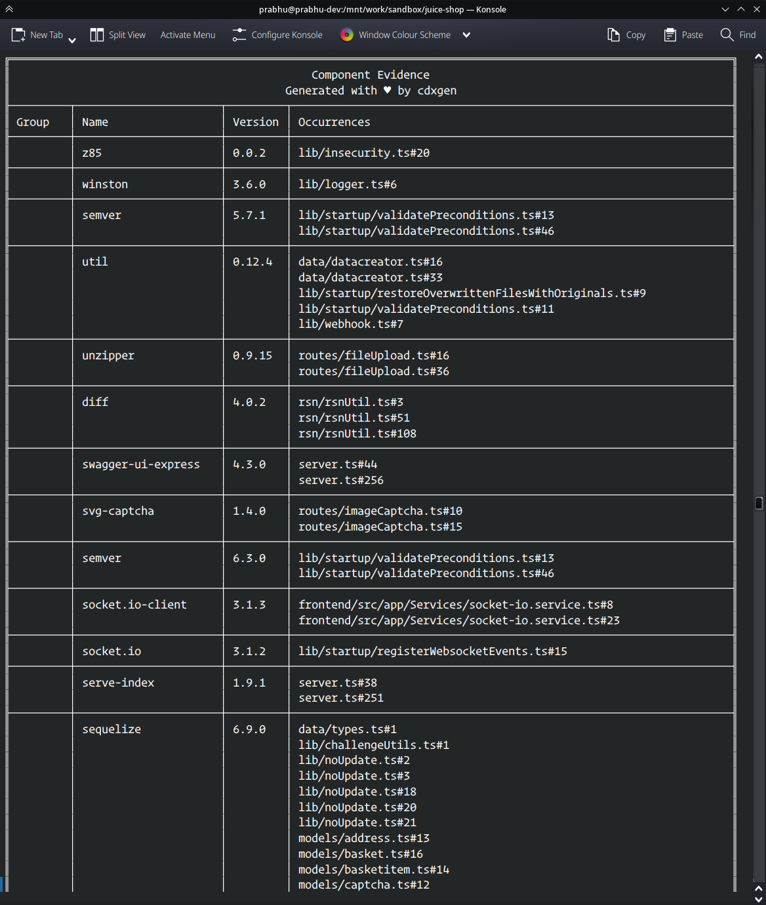
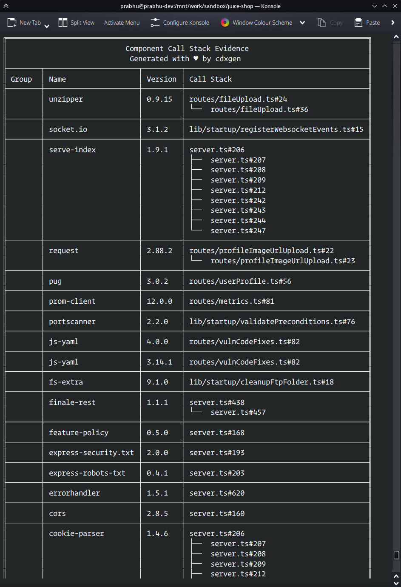
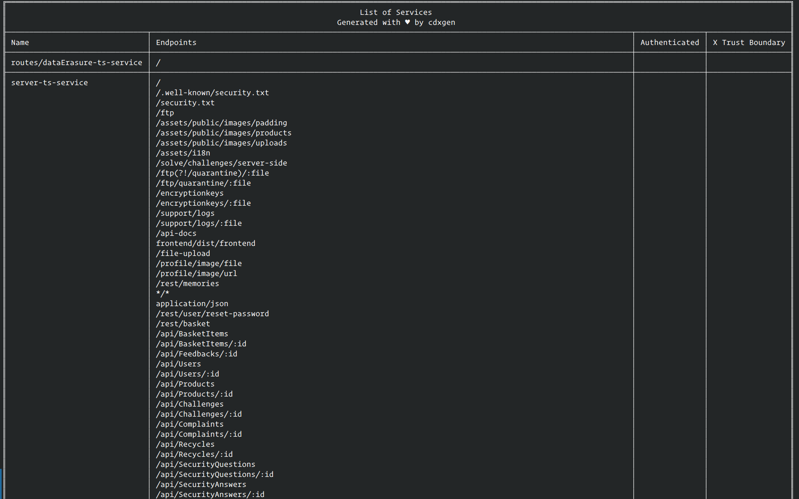

# Advanced Usage

## Exclude project types, files, and directories

To exclude specific [project types](https://cyclonedx.github.io/cdxgen/#/PROJECT_TYPES) from the BOM, use the `--exclude-type` argument. Multiple values are allowed.

Example:

Generate an SBOM for all types except js

```shell
--exclude-type js
```

Generate an SBOM for all types except github and dotnet

```shell
--exclude-type github --exclude-type dotnet
```

Use the argument `--exclude` to provide a glob pattern for files and directories to exclude from the BOM. Multiple values are allowed.

Example:

Exclude quickstarts directory.

```shell
--exclude "**/quickstarts/**"
```

Brace expansion is supported. `{openshift,kubernetes}-maven-plugin` in the below example, expands to `openshift-maven-plugin` and `kubernetes-maven-plugin`.

```shell
--exclude "**/quickstarts/**" --exclude "**/{openshift,kubernetes}-maven-plugin/**"
```

### Excluding packages using package manager configuration

Some package managers support filtering dependencies. For example, maven `dependency:tree` command supports [filtering](https://maven.apache.org/plugins/maven-dependency-plugin/examples/filtering-the-dependency-tree.html). It is possible to use some of the existing [environment variables](./ENV.md) to utilize these features.

Java maven example:

```shell
export MVN_ARGS="-Dexcludes=:::*-SNAPSHOT"
```

Gradle example:

```shell
export GRADLE_ARGS="--configuration runtimeClasspath"
```

## Filtering components

cdxgen can filter the components and the dependency tree before writing to a BOM json file. Three kinds of filters are allowed:

### Required only filter

Pass `--required-only` to only store components with the `scope` attribute set to `required`. These are usually considered direct dependencies.

```shell
cdxgen -t java -o /tmp/bom.json -p --required-only
```

Languages supported:

- Java with Maven
- Node.js
- Go
- Php

### Purl and properties filter

Use `--filter` to filter components containing the string in the purl or components.properties.value. Filters are case-insensitive.

Example 1: Filter all "springframework" packages

```shell
cdxgen -t java -o /tmp/bom.json -p --filter org.springframework
```

Example 2: Filter components belonging to the gradle profile "debugAndroidTestCompileClasspath" or "debugRuntimeClasspath"

```shell
cdxgen -t gradle -o /tmp/bom.json -p --filter debugAndroidTestCompileClasspath --filter debugRuntimeClasspath
```

### Include only filter

Use `--only` to include only those components containing the string in the purl. This can be used to generate BOM with "first party" components only.

```shell
cdxgen -t java -o /tmp/bom.json -p --only org.springframework
```

### Minimum confidence filter

Use `--min-confidence` with a value between 0 and 1 to filter components based on the confidence of their purl [identify](https://cyclonedx.org/docs/1.6/json/#components_items_evidence_identity_oneOf_i0_items_field). The logic involves looking for `field=purl` in `evidence.identity` and collecting the maximum `confidence` value. This is then compared against the minimum confidence passed as an argument.

```shell
cdxgen -t c . --min-confidence 0.1
```

The above would filter out all the zero confidence components in c/c++, so use it with caution.

### Analysis technique filter

Use `--technique` to list the techniques that cdxgen is allowed to use for the xBOM generation. Leaving this argument or using the value `auto` enables default behaviour.

Example 1 - only allow manifest-analysis:

```shell
cdxgen -t c . --technique manifest-analysis
```

Example 2 - allow manifest-analysis and source-code-analysis:

```shell
cdxgen -t c . --technique manifest-analysis --technique source-code-analysis
```

List of supported techniques:

- auto (default)
- source-code-analysis
- binary-analysis
- manifest-analysis
- hash-comparison
- instrumentation
- filename

Currently, this capability is implemented as a filter during post-processing, so unlikely to yield any performance benefits.

## Automatic compositions

When using any filters, cdxgen would automatically set the [compositions.aggregate](https://cyclonedx.org/docs/1.5/json/#compositions_items_aggregate) property to "incomplete" or "incomplete_first_party_only".

To disable this behavior, pass `--no-auto-compositions`.

## Configuration files

Tired of passing command line arguments to cdxgen?

JSON format

- .cdxgenrc
- .cdxgen.json

YAML format

- .cdxgen.yml
- .cdxgen.yaml

Examples:

```json
{
  "type": "java",
  "print": true,
  "output": "bom.json"
}
```

```yaml
# Java type
type: java
# Print the BOM as table and tree
print: true
# Set the output file
output: bom.json
# Only include these components in the BOM
only: org.springframework
```

### Environment variables

All command line arguments can also be passed as environment variables using the "CDXGEN\_" prefix.

```shell
export CDXGEN_TYPE=java
export CDXGEN_PROJECT_NAME=foo
```

Environment variables override values from the configuration files.

### Config value ordering

- Command-line arguments
- Environment variables
- Configuration files (JSON first, followed by yaml)

## Evinse Mode / SaaSBOM

Evinse (Evinse Verification Is Nearly SBOM Evidence) is a new command with cdxgen to generate component evidence and SaaSBOM for supported languages. The tool is powered by [atom](https://github.com/AppThreat/atom). Beginning with cdxgen 9.9.x, cdxgen accepts a new argument called `--evidence` to generate such a comprehensive SBOM. This section is left for users interested in invoking the evinse tool directly for advanced use cases.







### Pre-requisites

- Java > 21 installed
- Application source code
- Input SBOM in CycloneDX >1.5 format. Use cdxgen to generate one.

### Usage

```shell
evinse -h
Options:
  -i, --input                    Input SBOM file. Default bom.json
                                                           [default: "bom.json"]
  -o, --output                   Output file. Default bom.evinse.json
                                                    [default: "bom.evinse.json"]
  -l, --language                 Application language
  [choices: "java", "jar", "javascript", "python", "android", "cpp"] [default: "
                                                                          java"]
      --db-path                  Atom slices DB path. Default /home/prabhu/.loca
                                 l/share/.atomdb
                                  [default: "/home/prabhu/.local/share/.atomdb"]
      --force                    Force creation of the database
                                                      [boolean] [default: false]
      --skip-maven-collector     Skip collecting jars from maven and gradle cach
                                 es. Can speedup re-runs if the data was cached
                                 previously.          [boolean] [default: false]
      --with-deep-jar-collector  Enable collection of all jars from maven cache
                                 directory. Useful to improve the recall for cal
                                 lstack evidence.     [boolean] [default: false]
      --annotate                 Include contents of atom slices as annotations
                                                      [boolean] [default: false]
      --with-data-flow           Enable inter-procedural data-flow slicing.
                                                      [boolean] [default: false]
      --with-reachables          Enable auto-tagged reachable slicing. Requires
                                 SBOM generated with --deep mode.
                                                      [boolean] [default: false]
      --usages-slices-file       Use an existing usages slices file.
                                                 [default: "usages.slices.json"]
      --data-flow-slices-file    Use an existing data-flow slices file.
                                              [default: "data-flow.slices.json"]
      --reachables-slices-file   Use an existing reachables slices file.
                                             [default: "reachables.slices.json"]
  -p, --print                    Print the evidences as table          [boolean]
      --version                  Show version number                   [boolean]
  -h                             Show help                             [boolean]
```

To generate an SBOM with evidence for a java project.

```shell
evinse -i bom.json -o bom.evinse.json <path to the application>
```

By default, only occurrence evidence is determined by creating usages slices. To generate callstack evidence, pass either `--with-data-flow` or `--with-reachables`.

#### Reachability-based call stack evidence

atom supports reachability-based evidence generation for Java, JavaScript, and TypeScript applications. Reachability refers to data flows that originate from entry points (sources) ending at a sink (which are invocations to external libraries). The technique used is called "Forward-Reachability".

Two necessary prerequisites for this slicing mode are that the input SBOM must be generated with cdxgen and in deep mode (only for java, jars, python type) and must be placed within the application directory.

```shell
cd <path to the application>
cdxgen -t java --deep -o bom.json --evidence .
```

```shell
cd <path to the application>
cdxgen -t python --deep -o bom.json --evidence .
```

For JavaScript and TypeScript applications, deep mode is optional.

```shell
cd <path to the application>
cdxgen -t js -o bom.json .
evinse -i bom.json -o bom.evinse.json -l js --with-reachables .
```

#### Data flow-based call stack evidence

Often reachability cannot be computed reliably due to the presence of wrapper libraries or mitigating layers. Further, the repository being analyzed could be a common module containing only the sink methods without entry points (sources). In such cases, data-flow-based slicing can be used to compute call stack using a "Reverse-Reachability" algorithm. This is however a time and resource-consuming operation and might even require atom to be run externally in [java mode](https://cyclonedx.github.io/cdxgen/#/ADVANCED?id=use-atom-in-java-mode).

```shell
evinse -i bom.json -o bom.evinse.json --with-data-flow <path to the application>
```

#### Performance tuning

To improve performance, you can cache the generated usages and data-flow slices file along with the bom file.

```shell
evinse -i bom.json -o bom.evinse.json --usages-slices-file usages.json --data-flow-slices-file data-flow.json --with-data-flow <path to the application>
```

#### Other languages

For JavaScript or TypeScript projects, pass `-l javascript`.

```shell
evinse -i bom.json -o bom.evinse.json --usages-slices-file usages.json --data-flow-slices-file data-flow.json -l javascript --with-data-flow <path to the application>
```

For Python with cached usages and reachables file.

```shell
evinse -i bom.json -o bom.evinse.json --usages-slices-file usages.json --reachables-slices-file reachables.json -l python --with-reachables <path to the application>
```

## Generate SBOM from maven or gradle cache

There could be Java applications with complex dependency requirements. Or you might be interested in cataloging your Maven or gradle cache.
A bonus of this mode is that the resulting SBOM would have a property called `Namespaces` with a list of class names belonging to each jar.

### Generate evidence of usage

After generating an SBOM from a cache, we can now look for evidence of direct usage with evinse!

```shell
# compile or build your application
evinse -i <bom from cache> -o bom.evinse.json <application path>
# Generate data-flow evidence (Takes a while)
# evinse -i <bom from cache> -o bom.evinse.json --with-data-flow <application path>
```

Evinse would populate `component.evidence` objects with occurrences (default) and call stack (in data-flow mode). Those without evidence are either transitive or unused dependencies.

To improve performance for re-runs, pass the argument `--skip-maven-collector` to use the data cached in the SQLite database from the previous runs.

## Mixed Java Projects

If a java project uses maven and gradle, maven is selected for SBOM generation under default settings. To force cdxgen to use gradle, use the argument `-t gradle`. Similarly, use `-t scala` for scala SBT.

## Generating container SBOM on Windows

cdxgen supports generating container SBOM for Linux images on Windows. Follow the steps listed below.

- Ensure cdxgen-plugins-bin > 1.4.0 is installed.

```shell
npm install -g @cyclonedx/cdxgen-plugins-bin
```

- Run "Docker for Desktop" as an administrator with the 'Exposing daemon on TCP without TLS' setting turned on.
  Run Powershell terminal as administrator. Without this, cdxgen would fail while extracting symlinks.
- Invoke cdxgen with `-t docker`

```shell
cdxgen -t docker -o bom.json <image name>
```

## Generate SBOM with evidence for the cdxgen repo

Why not?

```shell
cdxgen -t js -o bom.json -p --no-recurse --evidence .

# Don't be surprised to see the service endpoint offered by cdxgen.
# Review the reachables.slices.json and file any vulnerabilities or bugs!
```

## Use Atom in Java mode

For large projects (> 1 million lines of code), atom must be invoked separately for the slicing operation. Follow the instructions below.

- Download the latest [atom.zip release](https://github.com/AppThreat/atom/releases)

```shell
unzip atom.zip
cd atom-1.0.0/bin

# Java project
./atom -J-Xmx16g usages -o app.atom --slice-outfile usages.json -l java <path to repo>

# C project
./atom -J-Xmx16g usages -o app.atom --slice-outfile usages.json -l c <path to repo>

node bin/cdxgen.js -o bom.json -t c --usages-slices-file usages.json <path to repo>
```

Change 16g to 32g or above for very large projects. For the Linux kernel, a minimum of 128GB is required.

## Remove the SQLite cache db used by evinse

If you face a situation where the namespaces cached by evinse are outdated or incorrect, you can try deleting the file `.atomdb` to recreate it. Below are the locations where this file gets stored by default. This can be overridden by setting the environment variable `ATOM_DB`.

```javascript
// linux
let ATOM_DB = join(homedir(), ".local", "share", ".atomdb");

// Windows
ATOM_DB = join(homedir(), "AppData", "Local", ".atomdb");

// Mac
ATOM_DB = join(homedir(), "Library", "Application Support", ".atomdb");
```

## Customize metadata.authors in BOM

Use the argument `--author` to override the author name. Use double quotes when the name includes spaces. Multiple values are allowed.

```
cdxgen --author "OWASP Foundation" --author "Apache Foundation" -t java ...
```

## Generate bash/zsh command completions

Run the commands such as cdxgen, evinse, etc with completion as the argument.

```shell
cdxgen completion >> ~/.zshrc

# cdxgen completion >> ~/.bashrc

# evinse completion >> ~/.zshrc
```

## BOM Profile

With profiles, cdxgen can generate a BOM that is optimized for a specific use case or purpose. The default is `generic`.

| Profile            | Purpose                                                                   | Configurations enabled                                                             |
| ------------------ | ------------------------------------------------------------------------- | ---------------------------------------------------------------------------------- |
| appsec             | BOM will be consumed by application security for vulnerability management | Enable deep mode                                                                   |
| research           | BOM for security research                                                 | Enables deep and evidence mode. Disable ignore directory for JavaScript/TypeScript |
| operational        | Generate OBOM                                                             | projectType set to os                                                              |
| license-compliance | Fetch license data                                                        | Set FETCH_LICENSE environment variable                                             |

## BOM lifecycles

By default, cdxgen attempts to generate a BOM for the `build` lifecycle [phase](https://cyclonedx.org/docs/1.5/json/#tab-pane_metadata_lifecycles_items_oneOf_i0) for applications and `post-build` phase for container images. Using the argument, `--no-install-deps` it is possible to generate `pre-build` BOM for certain languages and ecosystems (Eg: Python) by disabling the package installation feature. Or explicitly pass `--lifecycle post-build` to generate an SBOM for android, dotnet, and go binaries.

Example:

```shell
cdxgen -t android --lifecycle post-build -o bom.json <path to apks>
```

```shell
cdxgen -t dotnet --lifecycle post-build -o bom.json <path to dotnet binaries>
```

```shell
cdxgen -t go --lifecycle post-build -o bom.json <path to go binaries>
```

## Legacy dotnet and Java projects

To obtain transitive dependencies and a complete dependency tree for dotnet projects, `dotnet restore` command needs to be executed. Recent versions of cdxgen would attempt to restore all the solution and .csproj files when there are no `project.assets.json` files found.

This, however, requires the correct version of dotnet SDK to be installed. The official container image bundles version 8.0 of the SDK.

```shell
docker run --rm -v /tmp:/tmp -v $(pwd):/app:rw -it ghcr.io/cyclonedx/cdxgen -r /app -o bom.json -t dotnet
```

If the project requires a different version of the SDK, such as .Net core 3.1 or dotnet 6.0, then try with the below custom [images](https://github.com/CycloneDX/cdxgen/ci/base-images).

```shell
docker run --rm -v /tmp:/tmp -v $(pwd):/app:rw -it ghcr.io/cyclonedx/cdxgen-dotnet:v11 -r /app -o bom.json -t dotnet
```

If the project requires legacy frameworks such as .Net Framework 4.6/4.7, then a Windows operating system or container is required to generate the SBOM correctly. A workaround is to commit the project.assets.json and the lock files to the repository from Windows and run cdxgen from Linux as normal.

For legacy Java projects, use the custom images `ghcr.io/cyclonedx/cdxgen-java:v11` (Java 11) or `ghcr.io/cyclonedx/cdxgen-java17:v11` (Java 17). Alternatively, use the CLI arguments as shown.

```shell
cdxgen -t java11
cdxgen -t java17
```

[sdkman](https://sdkman.io) must be installed and setup for these arguments to work.

## Nydus - next-generation container image

[Nydus](https://github.com/dragonflyoss/nydus) enhances the current OCI image specification by improving container launch speed, image space and network bandwidth efficiency, and data integrity. cdxgen container images are available in nydus format with the `-nydus` suffix.

```
ghcr.io/cyclonedx/cdxgen:master-nydus
```

### Example invocation using nerdctl

Refer to the nydus-demo.yml workflow for an example github action that demonstrates the use of nydus snapshotter to improve the performance of cdxgen.

```shell
sudo nerdctl --snapshotter nydus run --rm -v $HOME/.m2:/root/.m2 -v $(pwd):/app ghcr.io/cyclonedx/cdxgen:master-nydus -p -t java /app
```

## Lima VM usage

Refer to the dedicated [readme](../contrib/lima/README.md). Rancher Desktop on macOS with nerdctl is supported by default.

## Export as protobuf binary

Pass the argument `--export-proto` to serialize and export the BOM as a protobuf binary. Only the spec version 1.5 is supported in this mode.

```shell
--export-proto --proto-bin-file bom.cdx.bin
```

## Include formulation

Pass the argument `--include-formulation` to collect the following information under the `formulation` section:

- git metadata such as files in the tree, origin url, branch, and CI environment variables
- build tools versions (Java, Python, Node.js, gcc, dotnet, rustc)

Example:

```
"formulation": [
    {
      "bom-ref": "f8324846-fad6-4927-a8e7-49379f57489b",
      "components": [
        {
          "type": "file",
          "name": ".gitattributes",
          "version": "eba1110b5794582b53554bb1e4224b860d4e173f"
        },
        {
          "type": "file",
          "name": "README_zh.md",
          "version": "70e6883720e454e3f2fe30c9730b3e56c35adc28"
        },
        {
          "type": "file",
          "name": "docker-compose.yml",
          "version": "7e9c878ee725717b3922225f26b99931332ae6c8"
        },
        {
          "type": "file",
          "name": "pom.xml",
          "version": "8da3449df64e6eb1d63ca3ca5fbd123a374d738e"
        },
        {
          "type": "file",
          "name": "src/main/java/org/joychou/Application.java",
          "version": "41169b9a018f38ee62e300047d5a6bd93562f512"
        },
        {
          "type": "file",
          "name": "src/main/resources/url/url_safe_domain.xml",
          "version": "ee81efcf364e18221c401e03f1d890348fe73e87"
        },
        {
          "type": "platform",
          "name": "dotnet",
          "version": "8.0.101",
          "description": "Microsoft.AspNetCore.App 6.0.26 [/usr/share/dotnet/shared/Microsoft.AspNetCore.App]\\nMicrosoft.AspNetCore.App 8.0.1 [/usr/share/dotnet/shared/Microsoft.AspNetCore.App]\\nMicrosoft.NETCore.App 6.0.26 [/usr/share/dotnet/shared/Microsoft.NETCore.App]\\nMicrosoft.NETCore.App 8.0.1 [/usr/share/dotnet/shared/Microsoft.NETCore.App]"
        },
        {
          "type": "platform",
          "name": "rustc",
          "version": "rustc 1.75.0 (82e1608df 2023-12-21)",
          "description": "cargo 1.75.0 (1d8b05cdd 2023-11-20)"
        },
        {
          "type": "platform",
          "name": "go",
          "version": "go version go1.21.6 linux/amd64"
        }
      ],
      "workflows": [
        {
          "bom-ref": "9f66ea8d-b1b7-4c79-8294-376903ec1bc8",
          "uid": "c451097b-5c74-49db-ada7-81bd77cdb390",
          "inputs": [
            {
              "source": {
                "ref": "git@github.com:HooliCorp/java-sec-code.git"
              },
              "environmentVars": [
                {
                  "name": "GIT_BRANCH",
                  "value": "master"
                }
              ]
            }
          ],
          "taskTypes": [
            "clone"
          ]
        }
      ]
    }
  ]
```

## Generate Cryptography Bill of Materials (CBOM)

Use the `cbom` alias to generate a CBOM. This is currently supported only for Java and Python projects.

```shell
cbom -t java
# cdxgen -t java --include-crypto -o bom.json --spec-version 1.6 .
```

```shell
cbom -t python
# cdxgen -t python --include-crypto -o bom.json --spec-version .
```

Using the `cbom` alias sets the following options:

- includeCrypto: true
- includeFormulation: true
- evidence: true
- specVersion: 1.6
