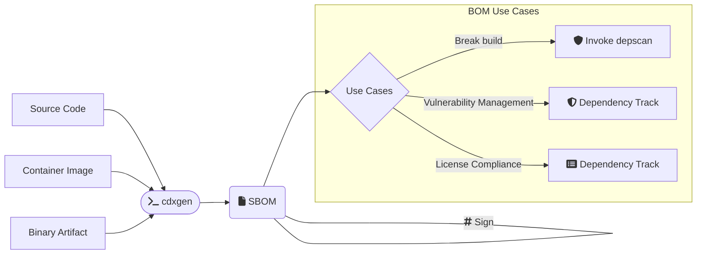

# CLI Usage

## Overview

In CLI mode, you can invoke cdxgen with Source Code, Container Image, or Binary Artifact as input to generate a Software Bill-of-Materials document. This can be subsequently used for a range of use cases as shown.



## Installing

```shell
sudo npm install -g @cyclonedx/cdxgen

# For CycloneDX 1.4 compatibility use version 8.6.0 or pass the argument `--spec-version 1.4`
sudo npm install -g @cyclonedx/cdxgen@8.6.0
```

If you are a [Homebrew](https://brew.sh/) user, you can also install [cdxgen](https://formulae.brew.sh/formula/cdxgen) via:

```shell
$ brew install cdxgen
```

Deno install is also supported.

```shell
deno install --allow-read --allow-env --allow-run --allow-sys=uid,systemMemoryInfo,gid --allow-write --allow-net -n cdxgen "npm:@cyclonedx/cdxgen/cdxgen"
```

You can also use the cdxgen container image

```bash
docker run --rm -v /tmp:/tmp -v $(pwd):/app:rw -t ghcr.io/cyclonedx/cdxgen -r /app -o /app/bom.json

docker run --rm -v /tmp:/tmp -v $(pwd):/app:rw -t ghcr.io/cyclonedx/cdxgen:v8.6.0 -r /app -o /app/bom.json
```

To use the deno version, use `ghcr.io/cyclonedx/cdxgen-deno` as the image name.

```bash
docker run --rm -v /tmp:/tmp -v $(pwd):/app:rw -t ghcr.io/cyclonedx/cdxgen-deno -r /app -o /app/bom.json
```

In deno applications, cdxgen could be directly imported without any conversion. Please see the section on [integration as library](#integration-as-library)

```ts
import { createBom, submitBom } from "npm:@cyclonedx/cdxgen@^9.0.1";
```

## Getting Help

```text
$ cdxgen -h

Options:
  -o, --output                 Output file. Default bom.json
  -t, --type                   Project type
  -r, --recurse                Recurse mode suitable for mono-repos. Defaults to
                                true. Pass --no-recurse to disable.
                                                       [boolean] [default: true]
  -p, --print                  Print the SBOM as a table with tree.    [boolean]
  -c, --resolve-class          Resolve class names for packages. jars only for n
                               ow.                                     [boolean]
      --deep                   Perform deep searches for components. Useful whil
                               e scanning C/C++ apps, live OS and oci images.
                                                                       [boolean]
      --server-url             Dependency track url. Eg: https://deptrack.cyclon
                               edx.io
      --api-key                Dependency track api key
      --project-group          Dependency track project group
      --project-name           Dependency track project name. Default use the di
                               rectory name
      --project-version        Dependency track project version    [default: ""]
      --project-id             Dependency track project id. Either provide the i
                               d or the project name and version together
      --parent-project-id      Dependency track parent project id
      --required-only          Include only the packages with required scope on
                               the SBOM. Would set compositions.aggregate to inc
                               omplete unless --no-auto-compositions is passed.
                                                                       [boolean]
      --fail-on-error          Fail if any dependency extractor fails. [boolean]
      --no-babel               Do not use babel to perform usage analysis for Ja
                               vaScript/TypeScript projects.           [boolean]
      --generate-key-and-sign  Generate an RSA public/private key pair and then
                               sign the generated SBOM using JSON Web Signatures
                               .                                       [boolean]
      --server                 Run cdxgen as a server                  [boolean]
      --server-host            Listen address             [default: "127.0.0.1"]
      --server-port            Listen port                     [default: "9090"]
      --install-deps           Install dependencies automatically for some proje
                               cts. Defaults to true but disabled for containers
                                and oci scans. Use --no-install-deps to disable
                               this feature.           [boolean] [default: true]
      --validate               Validate the generated SBOM using json schema. De
                               faults to true. Pass --no-validate to disable.
                                                       [boolean] [default: true]
      --evidence               Generate SBOM with evidence for supported languag
                               es.                    [boolean] [default: false]
      --spec-version           CycloneDX Specification version to use. Defaults
                               to 1.5                             [default: 1.5]
      --filter                 Filter components containing this word in purl or
                                component.properties.value. Multiple values allo
                               wed.                                      [array]
      --only                   Include components only containing this word in
                                purl. Useful to generate BOM with first party co
                               mponents alone. Multiple values allowed.  [array]
      --author                 The person(s) who created the BOM. Set this value
                                if you're intending the modify the BOM and claim
                                authorship.[array] [default: "OWASP Foundation"]
      --profile                BOM profile to use for generation. Default generi
                               c.
  [choices: "appsec", "research", "operational", "threat-modeling", "license-com
                                       pliance", "generic"] [default: "generic"]
      --include-formulation    Generate formulation section using git metadata.
                                                      [boolean] [default: false]
      --auto-compositions      Automatically set compositions when the BOM was f
                               iltered. Defaults to true
                                                       [boolean] [default: true]
  -h, --help                   Show help                               [boolean]
  -v, --version                Show version number                     [boolean]
```

All boolean arguments accept `--no` prefix to toggle the behavior.
