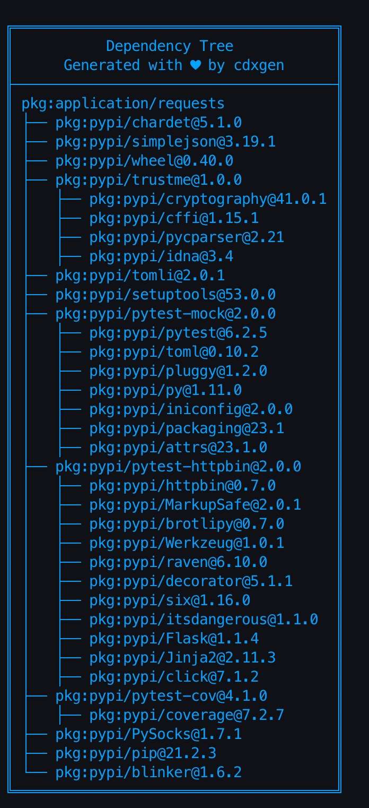

# Project Types

## Overview

The following **Project Types** are supported:

- When in `CLI` mode, passed as `t` or `--type` flag
- When in `Server` mode, passed as `projectType` parameter.

_Note: there are multiple project types / aliases that will produce the same output_

## Supported languages and package formats

| Language/Platform          | Project Types                                                                                                                                                                                      | Package Formats                                                                                                                       | Supported Evidence                                                                                    | Supports Transitives |
| -------------------------- | -------------------------------------------------------------------------------------------------------------------------------------------------------------------------------------------------- | ------------------------------------------------------------------------------------------------------------------------------------- | ----------------------------------------------------------------------------------------------------- | -------------------- |
| Node.js                    | `npm`, `pnpm`, `nodejs`, `js`, `javascript`, `typescript`, `ts`, `tsx`, `yarn`, `rush`                                                                                                             | `npm-shrinkwrap.json`, `package-lock.json`, `pnpm-lock.yaml`, `yarn.lock`, `rush.js`, `bower.json`, `.min.js`                         | Yes, except for `.min.js`                                                                             | ✅                   |
| Node.js (Specific version) | `node8`, `node10`, `node12`, `node14`, `node16`, `node18`, `node20`, `node22`, `node23`, `nodejs8`, `nodejs10`, `nodejs12`, `nodejs14`, `nodejs16`, `nodejs18`, `nodejs20`, `nodejs22`, `nodejs23` | `npm-shrinkwrap.json`, `package-lock.json`, `pnpm-lock.yaml`, `yarn.lock`, `rush.js`, `bower.json`, `.min.js`                         | Yes, except for `.min.js`                                                                             | ✅                   |
| Java (Default)             | `java`, `groovy`, `kotlin`, `scala`, `jvm`, `gradle`, `mvn`, `maven`, `sbt`                                                                                                                        | `pom.xml` [1], `build.gradle`, `.kts`, `sbt`, `bazel`                                                                                 | Yes, unless `pom.xml` is manually parsed due to unavailability of maven or errors)                    | ✅                   |
| Java (Specific version)    | `java8`, `java11`, `java17`, `java21`, `java22`, `java23`                                                                                                                                          | `pom.xml` [1], `build.gradle`, `.kts`, `sbt`, `bazel`                                                                                 | Yes, unless `pom.xml` is manually parsed due to unavailability of maven or errors)                    | ✅                   |
| Android                    | `android`, `apk`, `aab`                                                                                                                                                                            | `apk`, `aab`                                                                                                                          | -                                                                                                     | -                    |
| JAR                        | `jar`                                                                                                                                                                                              | `.jar`                                                                                                                                | -                                                                                                     | -                    |
| JAR (Gradle Cache)         | `gradle-index`, `gradle-cache`                                                                                                                                                                     | `$HOME/caches/modules-2/files-2.1/\*\*/\*.jar`                                                                                        | -                                                                                                     | -                    |
| JAR (SBT Cache)            | `sbt-index`, `sbt-cache`                                                                                                                                                                           | `$HOME/.ivy2/cache/\*\*/\*.jar `                                                                                                      | -                                                                                                     | -                    |
| JAR (Maven Cache)          | `maven-index`, `maven-cache`, `maven-repo`                                                                                                                                                         | `$HOME/.m2/repository/\*\*/\*.jar`                                                                                                    | -                                                                                                     | -                    |
| Python (Default)           | `python`, `py`, `pypi`                                                                                                                                                                             | `pyproject.toml`, `setup.py`, `requirements.txt` [2], `Pipfile.lock`, `poetry.lock`, `pdm.lock`, `bdist_wheel`, `.whl`, `.egg-info`   | Yes using the automatic pip install/freeze. When disabled, only with `Pipfile.lock` and `poetry.lock` | ✅                   |
| Python (Specific version)  | `python36`, `python38`, `python39`, `python310`, `python311`, `python312`                                                                                                                          | `pyproject.toml`, `setup.py`, `requirements.txt` [2], `Pipfile.lock`, `poetry.lock`, `pdm.lock`, `bdist_wheel`, `.whl`, `.egg-info`   | Yes using the automatic pip install/freeze. When disabled, only with `Pipfile.lock` and `poetry.lock` | -                    |
| Golang                     | `go`, `golang`                                                                                                                                                                                     | `binary`, `go.mod`, `go.sum`, `Gopkg.lock`                                                                                            | Yes except binary                                                                                     | ✅                   |
| Rust                       | `rust`, `rust-lang`, `cargo`                                                                                                                                                                       | `binary`, `Cargo.toml`, `Cargo.lock`                                                                                                  | Only for `Cargo.lock`                                                                                 | -                    |
| Ruby                       | `ruby`, `gems`                                                                                                                                                                                     | `Gemfile.lock`, `gemspec`                                                                                                             | Only for `Gemfile.lock`                                                                               | -                    |
| PHP                        | `php`, `composer`                                                                                                                                                                                  | Composer.lock                                                                                                                         | Yes                                                                                                   | ✅                   |
| .NET (#C)                  | `csharp`, `netcore`, `dotnet`, `vb`, `dotnet-framework`                                                                                                                                            | `.csproj`, `.vbproj`, `.fsproj`, `packages.config`, `project.assets.json` [3], `packages.lock.json`, `.nupkg`, `paket.lock`, `binary` | Only for `project.assets.json`, `packages.lock.json`, `paket.lock`                                    | -                    |
| Dart                       | `dart`, `flutter`, `pub`                                                                                                                                                                           | `pubspec.lock`, `pubspec.yaml`                                                                                                        | Only for `pubspec.lock`                                                                               | -                    |
| Haskell                    | `haskell`, `hackage`, `cabal`                                                                                                                                                                      | `cabal.project.freeze`                                                                                                                | Yes                                                                                                   |                      |
| Elixir                     | `elixir`, `hex`, `mix`                                                                                                                                                                             | `mix.lock`                                                                                                                            | Yes                                                                                                   | -                    |
| C++                        | `c`, `cpp`, `c++`, `conan`                                                                                                                                                                         | `conan.lock`, `conanfile.txt`, `\*.cmake`, `CMakeLists.txt`, `meson.build`, codebase without package managers!                        | Yes only for `conan.lock`. Best effort basis for `cmake` without version numbers.                     | ✅                   |
| Clojure                    | `clojure`, `edn`, `clj`, `leiningen`                                                                                                                                                               | `deps.edn`, `project.clj`                                                                                                             | Yes unless the files are parsed manually due to lack of clojure cli or leiningen command              | -                    |
| GitHub Actions             | `github`, `actions`                                                                                                                                                                                | `.github/workflows/\*.yml`                                                                                                            | n/a                                                                                                   | ✅                   |
| Operation System (OS)      | `os`, `osquery`, `windows`, `linux`, `mac`, `macos`, `darwin`                                                                                                                                      |
| Jenkins Plugins            | `jenkins`                                                                                                                                                                                          | `.hpi files`                                                                                                                          | -                                                                                                     | ✅                   |
| Helm                       | `helm`, `charts`                                                                                                                                                                                   | `.yaml`                                                                                                                               | n/a                                                                                                   |                      |
| Helm (Cache)               | `helm-index`, `helm-repo`                                                                                                                                                                          | `$HOME/.cache/helm/repository/\*\*/\*.yaml`                                                                                           | -                                                                                                     | -                    |
| Container                  | `oci`, `docker`, `podman`, `container`                                                                                                                                                             | n/a                                                                                                                                   | -                                                                                                     |
| Container File             | `universal`, `containerfile`, `docker-compose`, `dockerfile`, `swarm`, `tekton`, `kustomize`, `operator`, `skaffold`, `kubernetes`, `openshift`, `yaml-manifest`                                   | `.yaml`, `docker-compose\*.yml`, `*Dockerfile*`, `*Containerfile*`, `bitbucket-pipelines.yml`                                         | n/a                                                                                                   | -                    |
| Google Cloud Build         | `cloudbuild`                                                                                                                                                                                       | `cloudbuild.yaml`                                                                                                                     | n/a                                                                                                   | -                    |
| Swift (iOS)                | `swift`                                                                                                                                                                                            | `Package.resolved`, `Package.swift` (swiftpm)                                                                                         | Yes                                                                                                   | -                    |
| Binary                     | `binary`, `blint`                                                                                                                                                                                  |
| Open API                   | `yaml-manifest`                                                                                                                                                                                    | `openapi\*.json`, `openapi\*.yaml`                                                                                                    | n/a                                                                                                   | -                    |

_*NOTE:*_

> - Apache maven 3.x is required for parsing pom.xml
> - gradle or gradlew is required to parse gradle projects
> - sbt is required for parsing scala sbt projects. Only scala 2.10 + sbt 0.13.6+ and 2.12 + sbt 1.0+ are currently supported.
>   - Alternatively, create a lock file using sbt-dependency-lock [plugin](https://github.com/stringbean/sbt-dependency-lock)
> - sdkman must be installed and setup to use the new Java with version types such as java8, java11.
> - While python3.6 is supported (-t python36), dependency tree construction requires python >= 3.9

Use of the container image is recommended in all these cases, since it has the build tools pre-installed.

_*Footnotes:*_

- [1] - For multi-module applications, the BOM file could include components not included in the packaged war or ear file.
- [2] - Pip freeze is automatically performed to improve precision. Requires virtual environment.
- [3] - Perform dotnet or nuget restore to generate project.assets.json. Without this file, cdxgen would not include indirect dependencies.
- [4] - See the section on plugins
- [5] - Powered by osquery. See the section on plugins

